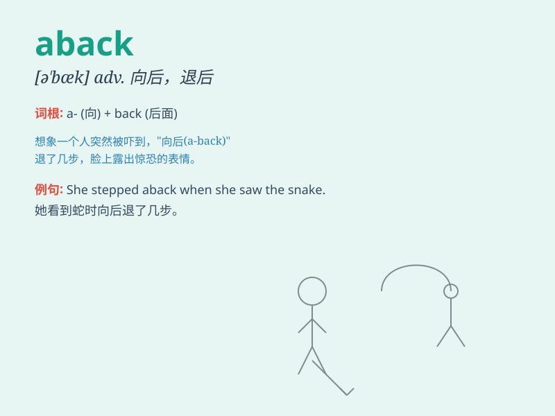

## aback

**英音:** _[ə\'bæk]_ **美音:** _[ə\'bæk]_

**译义:** *adv.向后地*

### 短语

+ **be taken aback:** _大吃一惊；惊得目瞪口呆_

+ **set aback:** _使挫折；使受阻碍_

+ **start aback:** _惊退；大吃一惊_

+ **come aback:** _回来；折回_

+ **turn aback:** _往回走；折回_

### 例句

#### 例句1

> **She was taken aback by his sudden anger.**

**中文翻译:** 她被他突然的愤怒吓了一跳。

**单词释义:** 吓一跳；大吃一惊

#### 例句2

> **The news took me aback.**

**中文翻译:** 这消息使我大吃一惊。

**单词释义:** 使吃惊；使吓一跳

#### 例句3

> **He was aback when he saw the huge bill.**

**中文翻译:** 当他看到巨额账单时，他大吃一惊。

**单词释义:** 吃惊；惊愕

### 背诵小故事

> 有一天，小明在海上划船。突然，一阵狂风袭来，把他打得 aback
。他完全没有料到，被这股力量弄得措手不及。后来他才明白，aback
就是表示吃惊、吓一跳。

**有一天小明划船被狂风袭击，让他感到吃惊、措手不及，以此来记住 aback
表示吃惊、吓一跳的意思。**

### 图义

