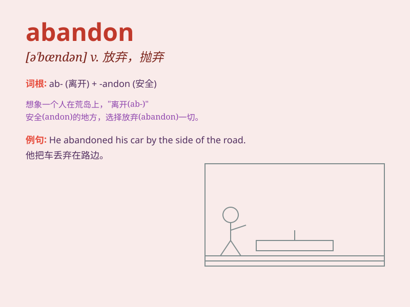

## abandon

**英音:** _[ə\'bænd(ə)n]_ **美音:** _[ə\'bændən]_

**译义:** *vt.放弃,遗弃;n.放任,狂热*

### 短语

+ **abandon oneself to:** _沉溺于；放纵_

+ **with abandon:** _肆意地；放纵地_

+ **abandon hope:** _放弃希望_

+ **abandon ship:** _弃船_

+ **abandon property:** _放弃财产_

### 例句

#### 例句1

> **He abandoned his car in the desert.**

**中文翻译:** 他把他的车丢弃在了沙漠里。

**单词释义:** 丢弃；遗弃

#### 例句2

> **The project was abandoned due to lack of funds.**

**中文翻译:** 这个项目因缺乏资金而被放弃了。

**单词释义:** 放弃

#### 例句3

> **She abandoned herself to grief after her husband\'s death.**

**中文翻译:** 她在丈夫死后陷入了极度的悲伤之中。

**单词释义:** 陷入；沉湎于

### 背诵小故事

> A man was on a ship. When a big storm came, he felt scared and
decided to abandon the ship. But later he regretted it. Remember,
abandon means to give up or leave something.

**一个男人在一艘船上。当一场大风暴来临，他感到害怕并决定抛弃这艘船。但后来他后悔了。记住，abandon
意思是放弃或离开某物。**

### 图义

