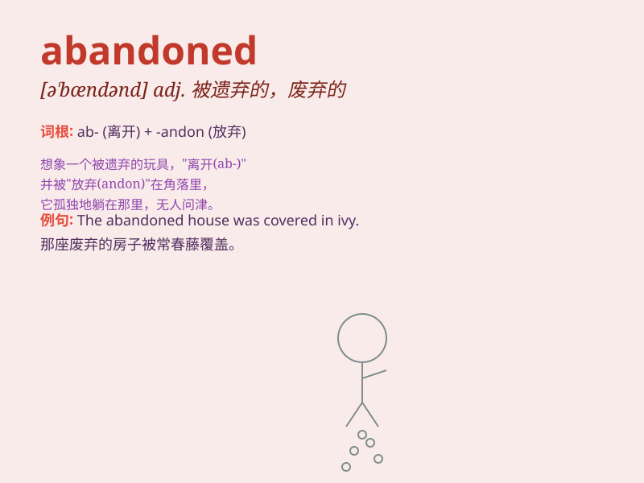

## abandoned

**英音:** _[ə\'bænd(ə)nd]_ **美音:** _[ə\'bændənd]_

**译义:** *adj.被抛弃的,自甘堕落的,没有约束的,放荡的*

### 短语

+ **abandoned building:** _废弃的建筑物_

+ **abandoned car:** _废弃的汽车_

+ **abandoned child:** _被遗弃的孩子_

+ **abandoned land:** _荒地_

+ **abandoned project:** _被放弃的项目_

### 例句

#### 例句1

> **The abandoned house looked creepy at night.**

**中文翻译:** 这座被遗弃的房子在晚上看起来很阴森。

**单词释义:** 被遗弃的

#### 例句2

> **She felt abandoned by her friends when they didn\'t invite her to
the party.**

**中文翻译:** 当朋友们没有邀请她参加聚会时，她感觉被抛弃了。

**单词释义:** 被抛弃的

#### 例句3

> **The abandoned car was rusting in the parking lot.**

**中文翻译:** 那辆被废弃的汽车在停车场里生锈了。

**单词释义:** 被废弃的

### 背诵小故事

> A man was lost in a dark forest. He felt abandoned by the world. No
one came to help him. But finally, he found his way out and never let
himself be in such a hopeless situation again.

**一个男人在黑暗的森林里迷路了。他感觉被世界抛弃了。没人来帮他。但最后，他找到了出路，再也不让自己处于这样绝望的境地。**

### 图义

