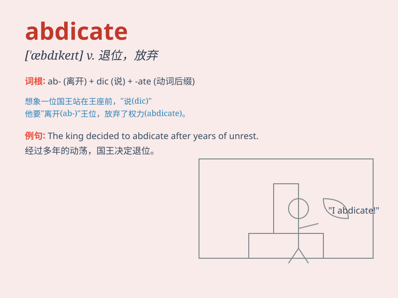

## abdicate

**英音:** _[\'æbdɪkeɪt]_ **美音:** _[\'æbdɪket]_

**译义:** *v.退位,放弃(职位,权力等)*

### 短语

+ **abdicate responsibility:** _放弃责任_

+ **abdicate the throne:** _退位_

+ **abdicate power:** _放弃权力_

+ **abdicate one\'s position:** _放弃职位_

+ **abdicate claim:** _放弃要求_

### 例句

#### 例句1

> **The king abdicated the throne and went into exile.**

**中文翻译:** 国王退位并流亡。

**单词释义:** 放弃（王位）

#### 例句2

> **He abdicated his responsibility as a father.**

**中文翻译:** 他放弃了作为父亲的责任。

**单词释义:** 放弃（职责）

#### 例句3

> **The company\'s CEO abdicated his position due to health
reasons.**

**中文翻译:** 公司的首席执行官因健康原因放弃了职位。

**单词释义:** 放弃（职位）

### 背诵小故事

>
从前有个国王，面对国家的重重困难，他感到无力承担责任，最终选择放弃王位，也就是
abdicate 了王位。这个国王的行为让人们感到惊讶和失望。

**从前有个国王，面对国家的重重困难，他感到无力承担责任，最终选择放弃王位，也就是放弃、退位了。这个国王的行为让人们感到惊讶和失望。**

### 图义

