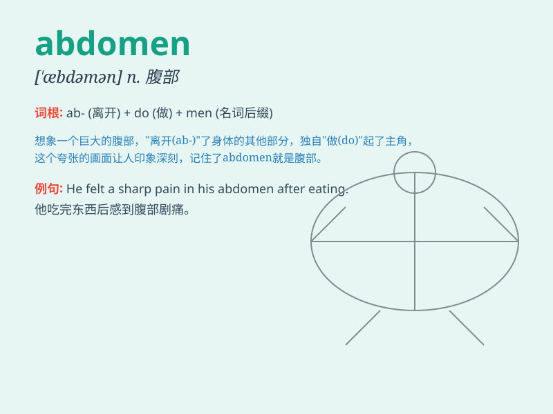

## abdomen

**英音:** _[\'æbdəmən; æb\'dəʊmən]_ **美音:**
_[\'æbdəmən]_

**译义:** *n.腹,腹部*

### 短语

+ **lower abdomen:** _下腹部_

+ **abdominal pain:** _腹痛_

+ **abdomen examination:** _腹部检查_

+ **muscles of the abdomen:** _腹部肌肉_

+ **flabby abdomen:** _松弛的腹部_

### 例句

#### 例句1

> **The doctor examined the patient\'s abdomen carefully.**

**中文翻译:** 医生仔细地检查了病人的腹部。

**单词释义:** 腹部

#### 例句2

> **She felt a sharp pain in her abdomen after eating too much.**

**中文翻译:** 她吃太多后感到腹部一阵剧痛。

**单词释义:** 腹部

#### 例句3

> **The pregnant woman gently rubbed her expanding abdomen.**

**中文翻译:** 这位孕妇轻轻地揉着她不断变大的腹部。

**单词释义:** 腹部

### 背诵小故事

> A doctor was examining a patient\'s abdomen. He gently touched and
said, \'This part from your chest to your pelvis is called abdomen.\'
The patient understood easily.

**一位医生正在检查病人的腹部。他轻轻地触摸并说："从你的胸部到骨盆的这部分叫做腹部。"病人很容易就理解了。**

### 图义

