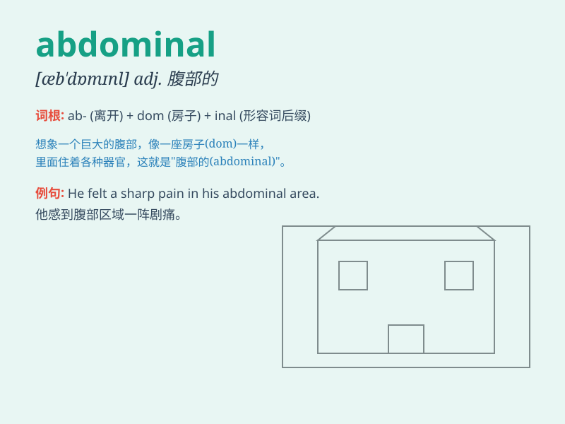

## abdominal

**英音:** _[æb\'dɒmɪn(ə)l]_ **美音:** _[æb\'dɑmənl]_

**译义:** *adj.腹部的*

### 短语

+ **abdominal pain:** _腹痛_

+ **abdominal muscle:** _腹肌_

+ **abdominal cavity:** _腹腔_

+ **abdominal distension:** _腹胀_

+ **abdominal breathing:** _腹式呼吸_

### 例句

#### 例句1

> **He has severe abdominal pain.**

**中文翻译:** 他有严重的腹痛。

**单词释义:** 腹部的

#### 例句2

> **The doctor examined her abdominal muscles.**

**中文翻译:** 医生检查了她的腹部肌肉。

**单词释义:** 腹部的

#### 例句3

> **Abdominal surgery is a major operation.**

**中文翻译:** 腹部手术是一个大手术。

**单词释义:** 腹部的

### 背诵小故事

>
想象一下，一个勇敢的冒险家在探索神秘洞穴时，不小心撞到了腹部（abdominal）。他捂着肚子，痛苦地呻吟着。这个部位对他的行动造成了很大影响，让他意识到保护腹部的重要性。

**想象一个冒险家撞到腹部，意识到保护腹部的重要性，以此记住 abdominal
表示腹部的**

### 图义

