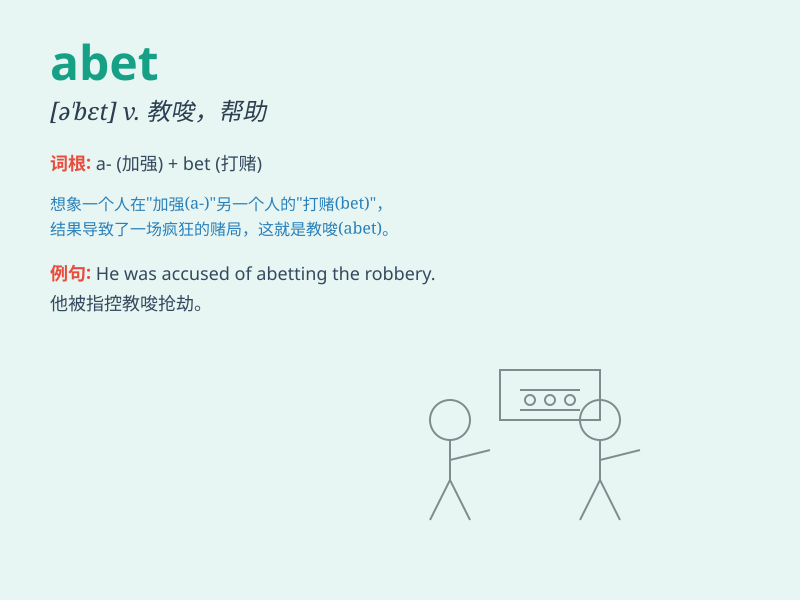

## abet

**英音:** _[ə\'bet]_ **美音:** _[ə\'bɛt]_

**译义:** *vt.教唆,煽动,帮助,支持*

### 短语

+ **abet an offender:** _教唆罪犯_

+ **abet a crime:** _教唆犯罪_

+ **abet in crime:** _参与犯罪教唆_

+ **abet illegal activities:** _教唆非法活动_

+ **abet someone\'s wrongdoing:** _教唆某人的错误行为_

### 例句

#### 例句1

> **He was accused of abetting the thief in the robbery.**

**中文翻译:** 他被指控在这次抢劫中教唆那个小偷。

**单词释义:** 教唆；煽动；帮助

#### 例句2

> **The gang leader was found guilty of abetting the murder.**

**中文翻译:** 这个犯罪团伙的头目被认定犯有教唆谋杀罪。

**单词释义:** 教唆；怂恿

#### 例句3

> **She was punished for abetting her friend\'s escape from
prison.**

**中文翻译:** 她因协助她朋友越狱而受到惩罚。

**单词释义:** 协助；支持

### 背诵小故事

> A thief was planning a robbery. His friend didn\'t stop him but
actually abet him. Later, both were caught. Remember, abet means to
encourage or assist someone, especially in doing something wrong.

**一个小偷正在计划抢劫。他的朋友不但不阻止他，反而教唆他。后来，两人都被抓住了。记住，abet
意思是教唆、怂恿，尤指做坏事。**

### 图义

