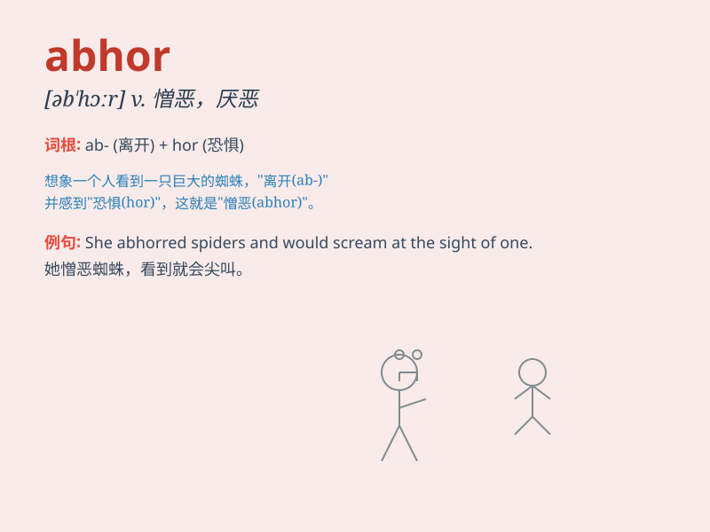

## abhor

**英音:** _[əb\'hɔː]_ **美音:** _[əb\'hɔr]_

**译义:** *vt.憎恶,痛恨*

### 短语

+ **abhor violence:** _憎恶暴力_

+ **abhor injustice:** _痛恨不公正_

+ **abhor cruelty:** _厌恶残忍_

+ **abhor lies:** _憎恶谎言_

+ **abhor crime:** _痛恨犯罪_

### 例句

#### 例句1

> **I abhor violence of any kind.**

**中文翻译:** 我憎恶任何形式的暴力。

**单词释义:** 憎恶

#### 例句2

> **She abhors the idea of cheating in exams.**

**中文翻译:** 她痛恨考试作弊的想法。

**单词释义:** 痛恨

#### 例句3

> **He abhors people who are cruel to animals.**

**中文翻译:** 他厌恶对动物残忍的人。

**单词释义:** 厌恶

### 背诵小故事

> A brave hero was in a dark forest. He saw a monster doing evil things
and he abhorred it. The monster\'s actions were so bad that the hero
decided to fight it to stop the evil.

**一位勇敢的英雄在黑暗的森林里。他看到一只怪物在做邪恶的事，他憎恶它。怪物的行为太恶劣了，英雄决定与之战斗来阻止邪恶。**

### 图义

