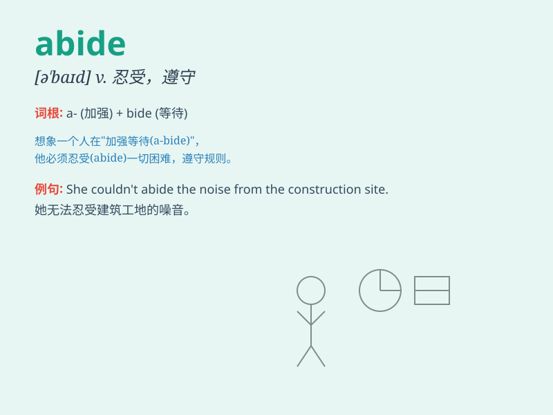

## abide

**英音:** _[ə\'baɪd]_ **美音:** _[ə\'baɪd]_

**译义:** *vi.坚持,遵守;vt.忍受,容忍*

### 短语

+ **abide by:** _遵守；信守_

+ **abide with:** _和\...\...在一起；与\...\...同住_

+ **abide in:** _居住；停留于_

+ **cannot abide:** _无法忍受_

+ **abide at:** _在\...\...逗留_

### 例句

#### 例句1

> **I can\'t abide people who are cruel to animals.**

**中文翻译:** 我无法容忍对动物残忍的人。

**单词释义:** 容忍；忍受

#### 例句2

> **You must abide by the rules of the game.**

**中文翻译:** 你必须遵守游戏规则。

**单词释义:** 遵守；遵循

#### 例句3

> **She couldn\'t abide waiting in queues.**

**中文翻译:** 她无法忍受排队等候。

**单词释义:** 忍受；忍耐

### 背诵小故事

> A brave knight had to abide by the king\'s rules. Even when the tasks
were tough, he never broke them. \'Abide\' means to accept and follow a
rule or decision. Just like the knight did.

**一位勇敢的骑士必须遵守国王的规定。即使任务艰巨，他也从不违反。\'abide\'意思是接受并遵循规则或决定。就像这位骑士所做的那样。**

### 图义

