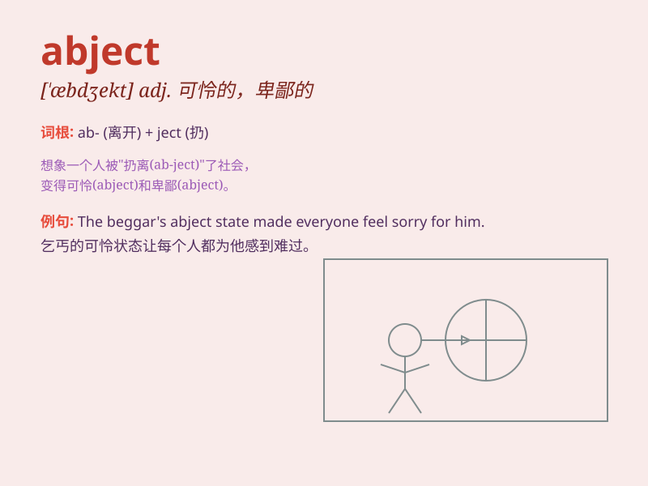

## abject

**英音:** _[\'æbdʒekt]_ **美音:** _[\'æbdʒɛkt]_

**译义:** *adj.卑鄙的,可怜的*

### 短语

+ **abject poverty:** _赤贫_

+ **abject failure:** _惨败；彻底的失败_

+ **abject surrender:** _可耻的投降_

+ **abject apology:** _低声下气的道歉_

+ **abject fear:** _极度的恐惧_

### 例句

#### 例句1

> **He lived in abject poverty.**

**中文翻译:** 他过着赤贫的生活。

**单词释义:** 凄惨的；糟透的；卑鄙的；（境况）凄惨的

#### 例句2

> **The refugees were in an abject condition.**

**中文翻译:** 难民们处于悲惨的境地。

**单词释义:** 悲惨的；可怜的

#### 例句3

> **His failure was abject.**

**中文翻译:** 他的失败是彻底的。

**单词释义:** 彻底的；完全的

### 背诵小故事

> A poor man was in an abject state. He had no job, no money, and even
lost his home. His life was full of misery and hopelessness. But
finally, he worked hard and changed his situation.

**一个可怜的人处于悲惨的境地。他没有工作，没有钱，甚至失去了家。他的生活充满了痛苦和绝望。但最终，他努力工作改变了自己的状况。**

### 图义

