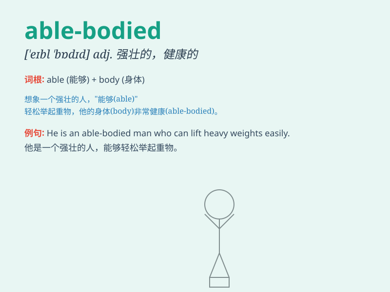

## able-bodied

**英音:** _[ˌeɪbl ˈbɒdid]_ **美音:** _[ˌeɪbl ˈbɑːdid]_

**译义:** *adj.体格健全的；强壮的；健康的*

### 短语

+ **able-bodied seaman:** _一级水手；熟练水手_

+ **able-bodied worker:** _强壮的工人；身体健全的工人_

+ **able-bodied population:** _健全人口；健康人群_

+ **able-bodied person:** _体格健全的人_

+ **able-bodied employee:** _身体健全的员工_

### 例句

#### 例句1

> **The company prefers to hire able-bodied workers for the
physically demanding job.**

**中文翻译:**
这家公司更愿意为这份体力要求高的工作雇用身体健全的工人。

**单词释义:** 身体健全的

#### 例句2

> **The able-bodied men were sent to the front line during the
war.**

**中文翻译:** 战争期间，身体强壮的男子被派往了前线。

**单词释义:** 身体强壮的

#### 例句3

> **We need able-bodied volunteers to help with the construction
work.**

**中文翻译:** 我们需要身体好的志愿者来帮忙做建筑工作。

**单词释义:** 身体好的

### 背诵小故事

> Once upon a time, there was a pirate ship. The captain needed strong
and healthy sailors. He only chose those who were able-bodied. These
sailors could handle any difficulties at sea and protect the ship.

**从前，有一艘海盗船。船长需要强壮健康的水手。他只选择那些身体健全强壮的。这些水手能够应对海上的任何困难并保护船只。**

### 图义

