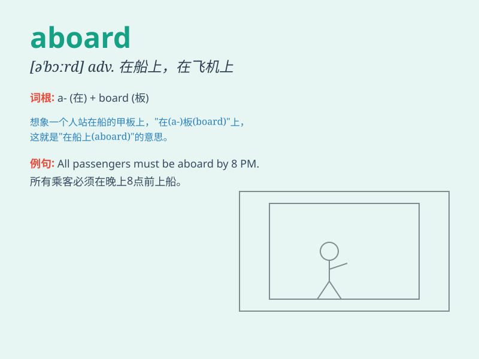

## aboard

**英音:** _[ə\'bɔːd]_ **美音:** _[ə\'bɔrd]_

**译义:** *adv.在船(飞机、车)上,上船(飞机、车)
prep.在(船、飞机、车)上,上(船、飞机、车)*

### 短语

+ **go aboard:** _上船；登机；上车_

+ **all aboard:** _请大家上车/船/飞机_

+ **come aboard:** _上船；登机；上车_

+ **welcome aboard:** _欢迎登机/上船_

+ **be aboard:** _在船上；在飞机上；在火车上_

### 例句

#### 例句1

> **We all went aboard the ship.**

**中文翻译:** 我们都登上了船。

**单词释义:** 在（船、飞机、火车等）上

#### 例句2

> **The passengers were waiting to board the plane when the
announcement was made.**

**中文翻译:** 当通知发布时，乘客们正等着登机。

**单词释义:** 登上（飞机）

#### 例句3

> **They welcomed us aboard the train.**

**中文翻译:** 他们在火车上欢迎我们。

**单词释义:** 在（火车）上

### 背诵小故事

>
想象你正在一艘大船上，准备开始一段冒险之旅。你兴奋地踏上甲板，嘴里喊着\'Aboard!
Aboard!\' 意思就是登上船啦。

**想象在船上，喊'aboard'表示登上船**

### 图义

