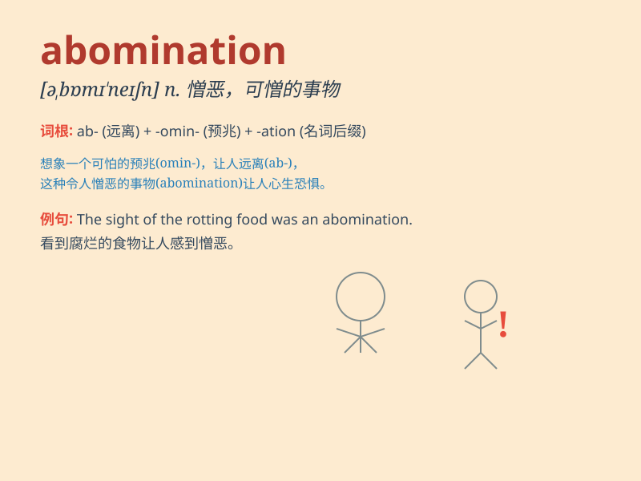

## abomination

**英音:** _[əbɒmɪ\'neɪʃ(ə)n]_ **美音:**
_[ə,bɑmɪ\'neʃən]_

**译义:** *n.憎恨,厌恶,可憎的事物*

### 短语

+ **an abomination to:** _令\...\...憎恶_

+ **commit abomination:** _犯下可憎的罪行_

+ **abomination of desolation:** _荒凉的可憎之物_

+ **hold something in abomination:** _对某物深恶痛绝_

+ **abomination of nature:** _违背自然的事物_

### 例句

#### 例句1

> **The use of chemical weapons is an abomination.**

**中文翻译:** 使用化学武器是一种令人憎恶的行为。

**单词释义:** 令人憎恶的事物

#### 例句2

> **He regarded the new law as an abomination that violated human
rights.**

**中文翻译:** 他认为新法律是侵犯人权的可恶之事。

**单词释义:** 可恶之事

#### 例句3

> **The act of cruelty towards animals is an abomination in the eyes
of many.**

**中文翻译:** 在许多人看来，对动物残忍的行为是令人深恶痛绝的。

**单词释义:** 深恶痛绝的事

### 背诵小故事

> A witch cast a spell, creating a terrifying monster that brought
chaos and destruction. Everyone saw this monster as an abomination. It
was so ugly and evil that people were filled with fear and disgust.

**一位女巫施了一个咒语，创造出一个可怕的怪物，带来了混乱和破坏。每个人都把这个怪物视为令人憎恶的东西。它又丑又邪恶，让人们充满了恐惧和厌恶。**

### 图义

