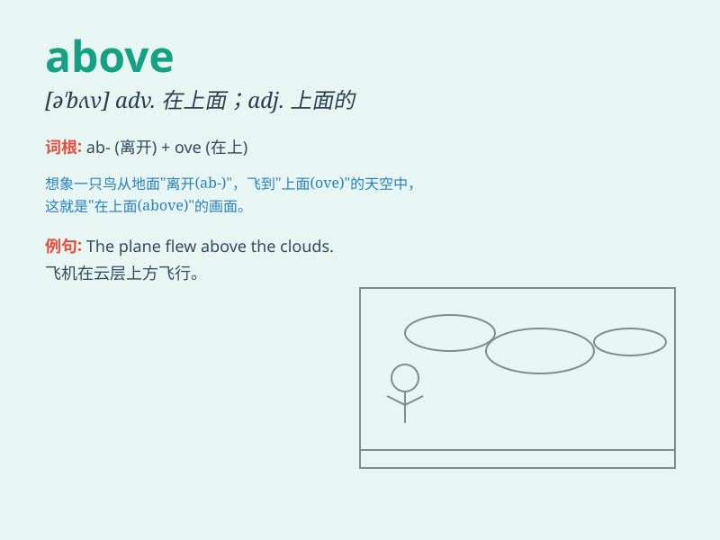

## above

**英音:** _[ə\'bʌv]_ **美音:** _[ə\'bʌv]_

**译义:**
*adj.上面的,上述的,上文的;adv.在上面;prep.在\...上方,过于,超出*

### 短语

+ **above all:** _首先；尤其是_

+ **above average:** _高于平均水平_

+ **above board:** _光明正大；诚实的_

+ **get above oneself:** _自高自大；变得傲慢_

+ **look above:** _向上看_

### 例句

#### 例句1

> **The temperature is above 30 degrees Celsius today.**

**中文翻译:** 今天的温度在 30 摄氏度以上。

**单词释义:** 超过，高于

#### 例句2

> **The airplane flew above the clouds.**

**中文翻译:** 飞机在云层之上飞行。

**单词释义:** 在\...\...之上

#### 例句3

> **Her performance was above average.**

**中文翻译:** 她的表现高于平均水平。

**单词释义:** 高于，超出

### 背诵小故事

> A bird was flying above the beautiful garden. It could see all the
colorful flowers and green grass. \'Above\' means at a higher position.
So the bird was at a higher position than the garden.

**一只鸟在美丽的花园上方飞翔。它能看到所有五颜六色的花和绿草。'above'意思是在更高的位置。所以这只鸟在比花园更高的位置。**

### 图义

