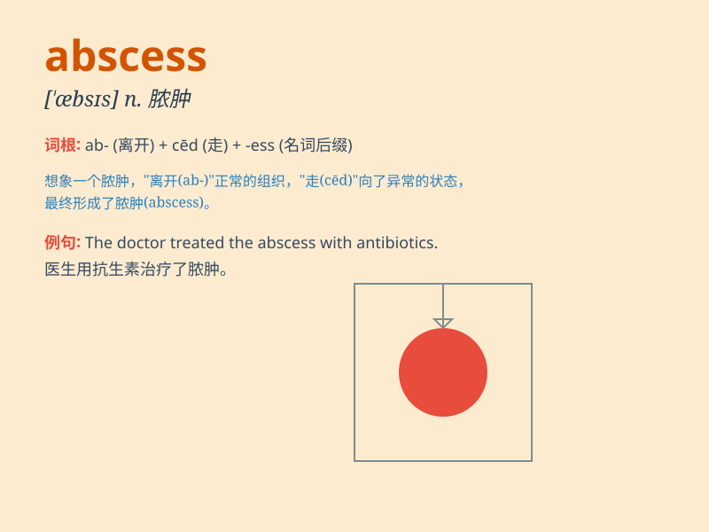

## abscess

**英音:** _[\'æbsɪs; -ses]_ **美音:** _[\'æb\'sɛs]_

**译义:** *n.脓肿,砂眼*

### 短语

+ **brain abscess:** _脑脓肿_

+ **liver abscess:** _肝脓肿_

+ **dental abscess:** _牙龈脓肿_

+ **cutaneous abscess:** _皮肤脓肿_

+ **subcutaneous abscess:** _皮下脓肿_

### 例句

#### 例句1

> **The doctor drained the abscess to relieve the patient\'s
pain.**

**中文翻译:** 医生排掉了脓肿以减轻病人的疼痛。

**单词释义:** 脓肿

#### 例句2

> **An abscess formed on his gum due to the infection.**

**中文翻译:** 由于感染，他的牙龈上长了一个脓肿。

**单词释义:** 脓肿

#### 例句3

> **The abscess was so large that it required immediate surgery.**

**中文翻译:** 这个脓肿太大了，需要立即手术。

**单词释义:** 脓肿

### 背诵小故事

> A brave adventurer was exploring a dark cave. Suddenly, he felt a
sharp pain on his leg and found an ABSCESS. It was a swollen and
infected area. He had to seek help quickly to get it treated.

**一位勇敢的探险家正在探索一个黑暗的洞穴。突然，他感到腿上一阵剧痛，发现了一个脓肿。这是一个肿胀和感染的区域。他不得不赶紧寻求帮助来治疗它。**

### 图义

