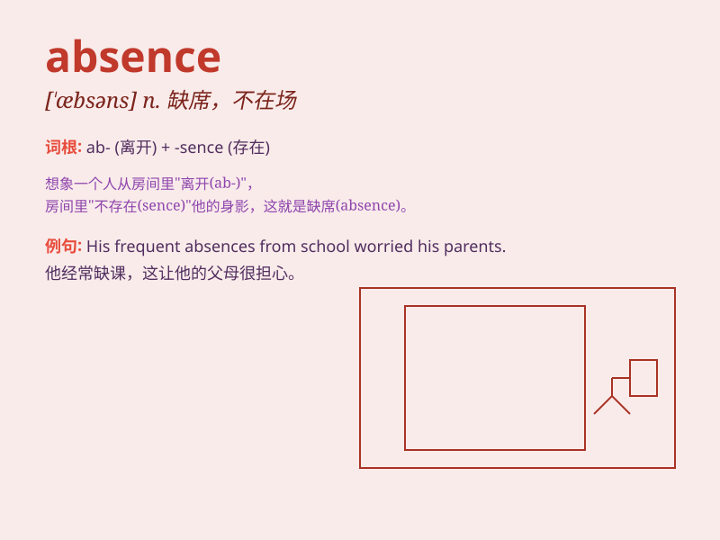

## absence

**英音:** _[\'æbs(ə)ns]_ **美音:** _[\'æbsns]_

**译义:** *n.不在,缺席,缺乏,没有*

### 短语

+ **in absence:** _不在；缺席_

+ **absence of mind:** _心不在焉_

+ **in the absence of:** _缺乏；不存在；在......不在场的情况下_

+ **long absence:** _长期缺席_

+ **temporary absence:** _暂时缺席_

### 例句

#### 例句1

> **His absence from the meeting was noticed by everyone.**

**中文翻译:** 他缺席会议被大家注意到了。

**单词释义:** 缺席

#### 例句2

> **In the absence of clear evidence, the case remains unsolved.**

**中文翻译:** 在缺乏明确证据的情况下，这个案子仍未解决。

**单词释义:** 缺乏

#### 例句3

> **The long absence of rain caused a drought.**

**中文翻译:** 长时间的无雨导致了干旱。

**单词释义:** 无，没有

### 背诵小故事

> A student named Tom was always present in class. But one day, he had
an absence. The teacher was worried and called his home. Later they knew
Tom was sick. So, absence means not being present.

**有个叫汤姆的学生总是按时上课。但有一天，他没来（absence）。老师很担心并给他家打电话。后来才知道汤姆生病了。所以，absence
意思是缺席、不在场。**

### 图义

