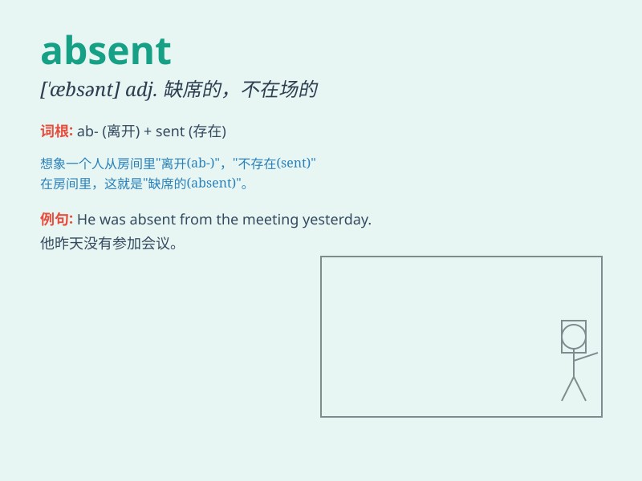

## absent

**英音:** _[ˈæbsənt;(for v.)əbˈsent]_ **美音:**
_[ˈæbsnt;(for v.)əbˈsɛnt]_

**译义:** *adj.不在的,缺席的,缺少的;vt.缺席*

### 短语

+ **absent from:** _缺席；不在_

+ **be absent:** _缺席；不在_

+ **absent-minded:** _心不在焉的；走神的_

+ **absent oneself from:** _缺席；不在_

+ **in an absent way:** _心不在焉地_

### 例句

#### 例句1

> **He has been absent from work for three days.**

**中文翻译:** 他已经旷工三天了。

**单词释义:** 缺席，不在

#### 例句2

> **She was absent-minded during the meeting.**

**中文翻译:** 她在会议期间心不在焉。

**单词释义:** 心不在焉的

#### 例句3

> **Love was totally absent from his childhood.**

**中文翻译:** 他童年时根本没有得到过爱。

**单词释义:** 不存在，没有

### 背诵小故事

> A boy was always absent from school. His teacher was very angry. But
when he finally came, he explained that he was helping an old man. So
\'absent\' means not being present.

**一个男孩总是缺课。他的老师非常生气。但当他最终来的时候，他解释说他在帮助一位老人。所以'absent'意思是缺席，不在场。**

### 图义

