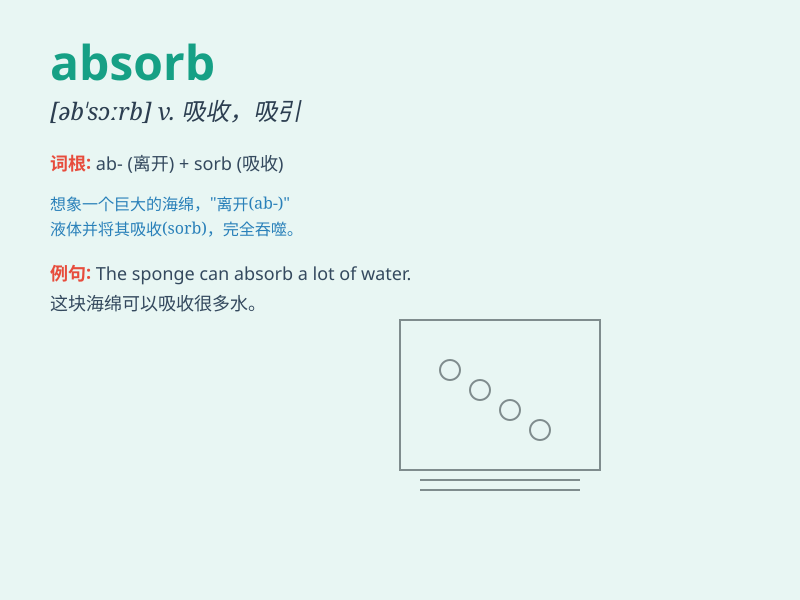

## absorb

**英音:** _[əb\'zɔːb; -\'sɔːb]_ **美音:** _[æbˈsɔrb;
æbˈzɔrb; əbˈsɔrb]_

**译义:** *vt.吸收,吸引*

### 短语

+ **absorb in:** _全神贯注于；专心于_

+ **be absorbed by:** _被\...\...吸收_

+ **be absorbed into:** _被吸收进；被融入_

+ **absorb oneself in:** _专心于；全神贯注于_

+ **absorb knowledge:** _吸收知识_

### 例句

#### 例句1

> **The sponge absorbs water easily.**

**中文翻译:** 海绵很容易吸水。

**单词释义:** 吸收

#### 例句2

> **He was completely absorbed in the book.**

**中文翻译:** 他完全沉浸在这本书里。

**单词释义:** 使全神贯注

#### 例句3

> **The company is trying to absorb smaller firms.**

**中文翻译:** 这家公司试图吞并较小的公司。

**单词释义:** 吞并；兼并

### 背诵小故事

> A thirsty sponge was placed in a pool of water. It took in all the
water quickly, just like how we \'absorb\' knowledge. The sponge\'s
action shows the meaning of \'absorb\' - to take in or soak up.

**一块口渴的海绵被放在一池水里。它很快吸收了所有的水，就像我们吸收知识一样。海绵的这个行为展示了'absorb'的意思------吸收、摄取。**

### 图义

