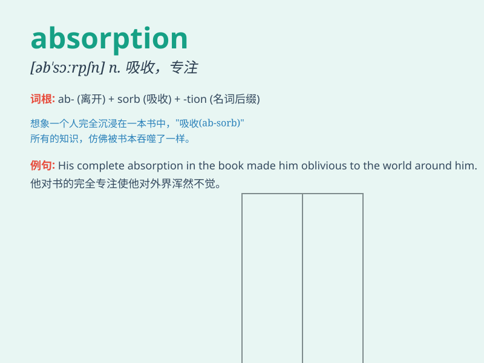

## absorption

**英音:** _[əb\'zɔːpʃ(ə)n; -\'sɔːp-]_ **美音:**
_[əbˈsɔrpʃən, -ˈzɔrp-]_

**译义:** *n.吸收*

### 短语

+ **absorption capacity:** _吸收能力_

+ **absorption coefficient:** _吸收系数_

+ **absorption spectrum:** _吸收光谱_

+ **heat absorption:** _热吸收_

+ **water absorption:** _吸水性；水吸收_

### 例句

#### 例句1

> **The absorption of nutrients is essential for our health.**

**中文翻译:** 营养物质的吸收对我们的健康至关重要。

**单词释义:** 吸收

#### 例句2

> **The company\'s absorption of smaller rivals helped it expand
rapidly.**

**中文翻译:** 这家公司对较小竞争对手的吞并帮助它迅速扩张。

**单词释义:** 吞并

#### 例句3

> **His absorption in the book made him oblivious to his
surroundings.**

**中文翻译:** 他全神贯注于这本书，以至于没有注意到周围的环境。

**单词释义:** 全神贯注

### 背诵小故事

> A scientist was studying how a sponge absorbs water. He saw the water
disappearing into the sponge quickly. The process of the water being
taken in is like \'absorption\'.

**一位科学家正在研究海绵如何吸水。他看到水很快被吸入海绵中。水被吸入的这个过程就像\'absorption（吸收）\'。**

### 图义

