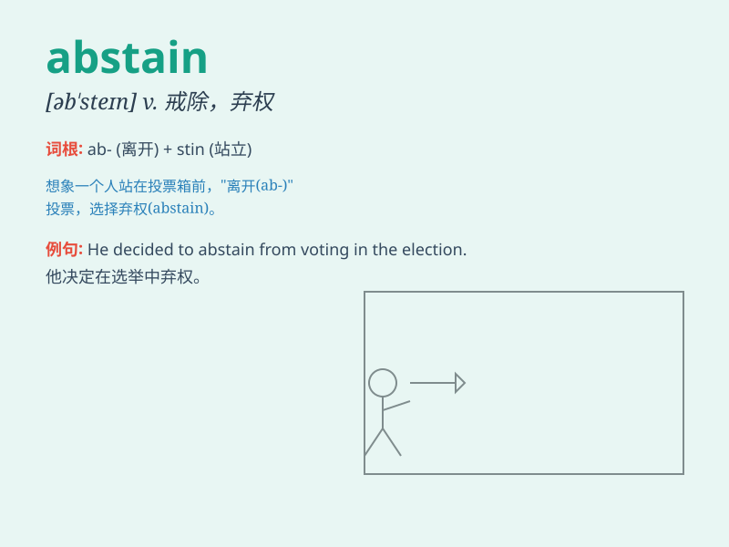

## abstain

**英音:** _[əb\'steɪn]_ **美音:** _[əb\'sten]_

**译义:** *v.禁绝,放弃*

### 短语

+ **abstain from:** _戒；避免；弃权_

+ **abstain completely:** _完全戒除_

+ **abstain voluntarily:** _自愿弃权_

+ **abstain temporarily:** _暂时戒除_

+ **abstain religiously:** _出于宗教原因戒绝_

### 例句

#### 例句1

> **He decided to abstain from smoking.**

**中文翻译:** 他决定戒烟。

**单词释义:** 戒除；弃权

#### 例句2

> **The judge had to abstain from the case due to a conflict of
interest.**

**中文翻译:** 由于利益冲突，这位法官不得不回避这个案子。

**单词释义:** 回避；避开

#### 例句3

> **Voters were encouraged to abstain if they had no clear
preference.**

**中文翻译:** 如果选民没有明确的偏好，就被鼓励弃权。

**单词释义:** 弃权

### 背诵小故事

> A king had a bad habit. His wise advisor told him to \'abstain\' from
it. The king struggled but finally controlled himself. By abstaining, he
became a better ruler. Remember, \'abstain\' means to hold back or
refrain.

**一位国王有个坏习惯。他睿智的顾问告诉他要"戒除"。国王努力挣扎但最终控制住了自己。通过戒除，他成为了更好的统治者。记住，\'abstain\'意思是抑制、戒除。**

### 图义

