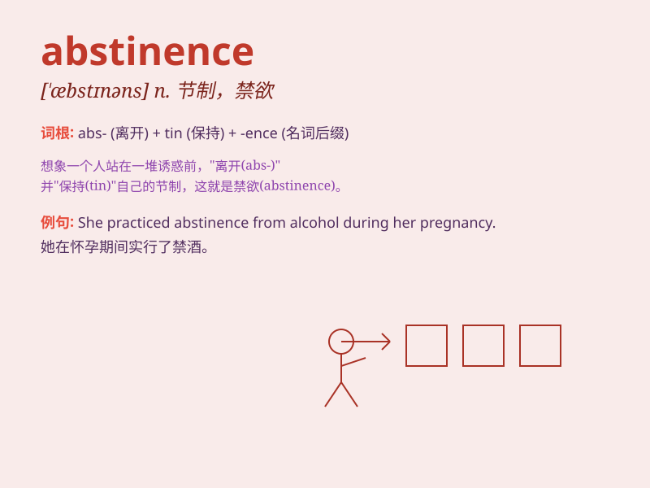

## abstinence

**英音:** _[\'æbstɪnəns]_ **美音:** _[\'æbstɪnəns]_

**译义:** *n.节制,节欲,戒酒*

### 短语

+ **total abstinence:** _完全戒绝_

+ **abstinence syndrome:** _戒断综合征_

+ **sexual abstinence:** _性节制；禁欲_

+ **abstinence from alcohol:** _戒酒_

+ **abstinence of smoking:** _戒烟_

### 例句

#### 例句1

> **He practiced abstinence from alcohol for several months.**

**中文翻译:** 他戒酒了好几个月。

**单词释义:** 戒除；节制（此处指戒除酒精）

#### 例句2

> **Abstinence from smoking is essential for good health.**

**中文翻译:** 戒烟对身体健康至关重要。

**单词释义:** 戒除；避免（此处指避免吸烟）

#### 例句3

> **The doctor recommended abstinence from rich foods to improve her
condition.**

**中文翻译:** 医生建议她忌食油腻食物以改善身体状况。

**单词释义:** 节制；克制（此处指克制食用油腻食物）

### 背诵小故事

> A person named Tom struggled with bad habits. But he decided to
change and practiced abstinence. He resisted temptation and finally
achieved a better life. Abstinence means self-restraint or the act of
refraining from something.

**有个人叫汤姆，一直被坏习惯困扰。但他决定改变，开始践行节制。他抵制住了诱惑，最终获得了更好的生活。abstinence
意思是节制；禁欲；戒除**

### 图义

