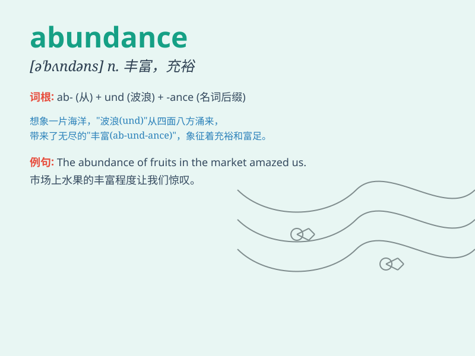

## abundance

**英音:** _[ə\'bʌnd(ə)ns]_ **美音:** _[ə\'bʌndəns]_

**译义:** *n.丰富,充裕,丰富充裕*

### 短语

+ **an abundance of:** _大量的；丰富的_

+ **in abundance:** _大量；丰富；充裕_

+ **abundance mentality:** _富足心态_

+ **relative abundance:** _相对丰度_

+ **natural abundance:** _自然丰度_

### 例句

#### 例句1

> **The region has an abundance of natural resources.**

**中文翻译:** 这个地区有丰富的自然资源。

**单词释义:** 丰富；大量

#### 例句2

> **She was amazed by the abundance of flowers in the garden.**

**中文翻译:** 她对花园里大量的花感到惊讶。

**单词释义:** 大量；充足

#### 例句3

> **The abundance of food at the party was impressive.**

**中文翻译:** 聚会上丰富的食物令人印象深刻。

**单词释义:** 丰富；充裕

### 背诵小故事

> Imagine a magical garden filled with all kinds of fruits and flowers.
There are so many that you can\'t count them. This garden represents
\'abundance\', meaning a large quantity or plenty of something.

**想象一个神奇的花园，里面满是各种各样的水果和花朵。多到数不清。这个花园就代表着"大量；丰富；充裕"的意思。**

### 图义

