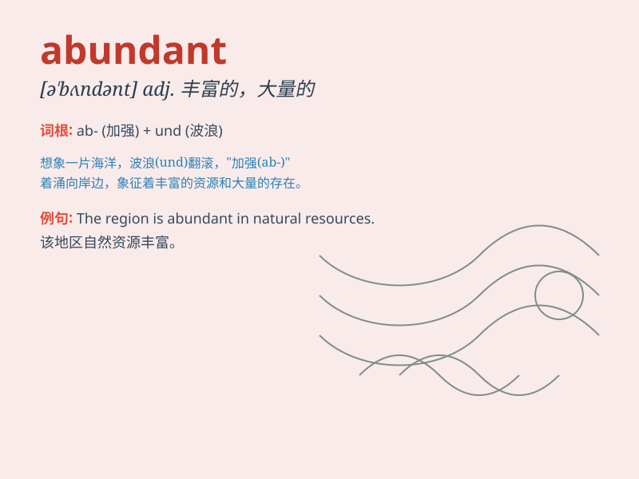

## abundant

**英音:** _[əˈbʌndənt]_ **美音:** _[ə\'bʌndənt]_

**译义:** *adj.丰富的,充裕的,丰富,盛产,富于*

### 短语

+ **abundant evidence:** _充足的证据_

+ **abundant resources:** _丰富的资源_

+ **abundant supply:** _大量供应_

+ **abundant rainfall:** _充沛的降雨_

+ **abundant harvest:** _丰收_

### 例句

#### 例句1

> **The region is abundant in natural resources.**

**中文翻译:** 这个地区自然资源丰富。

**单词释义:** 丰富的；充裕的

#### 例句2

> **We have an abundant supply of food.**

**中文翻译:** 我们有充足的食物供应。

**单词释义:** 充足的；大量的

#### 例句3

> **The tree bears abundant fruit every year.**

**中文翻译:** 这棵树每年都结出大量的果实。

**单词释义:** 大量的；丰盛的

### 背诵小故事

> A farmer had an abundant harvest this year. His fields were filled
with countless grains and fruits. The sight of such a rich yield made
him very happy. It showed that there was more than enough.

**一位农民今年获得了大丰收。他的田地里满是数不清的谷物和水果。看到如此丰富的收成，他非常高兴。这表明数量绰绰有余。**

### 图义

