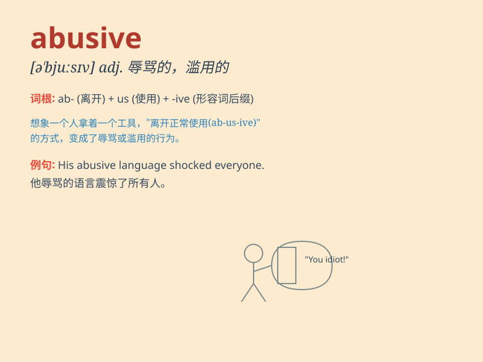

## abusive

**英音:** _[ə\'bjuːsɪv]_ **美音:** _[ə\'bjʊsɪv]_

**译义:** *adj.辱骂的,滥用的*

### 短语

+ **abusive language:** _辱骂性语言_

+ **abusive behavior:** _辱骂行为；虐待行为_

+ **abusive relationship:** _虐待关系；不良关系_

+ **abusive remarks:** _辱骂性言论_

+ **abusive power:** _滥用权力_

### 例句

#### 例句1

> **He was arrested for abusive behavior towards his girlfriend.**

**中文翻译:** 他因对女友的辱骂行为而被捕。

**单词释义:** 辱骂的；恶语的

#### 例句2

> **The boss\'s abusive language in the meeting was unacceptable.**

**中文翻译:** 老板在会议上的辱骂性语言是不可接受的。

**单词释义:** 辱骂的；侮辱性的

#### 例句3

> **She suffered from her husband\'s abusive treatment for years.**

**中文翻译:** 多年来她一直遭受着丈夫的虐待。

**单词释义:** 虐待的

### 背诵小故事

> A king was always abusive to his subjects. He shouted and scolded
them for no good reason. One day, people decided not to tolerate it
anymore. They stood up against his abusive behavior.

**一位国王总是辱骂他的臣民。他毫无理由地大喊大叫并斥责他们。有一天，人们决定不再容忍，他们站起来反抗他的辱骂行为。**

### 图义

