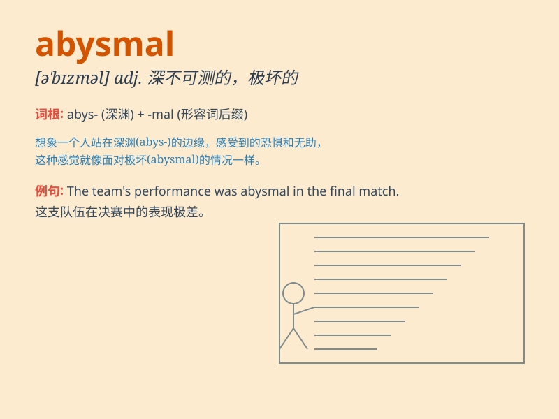

## abysmal

**英音:** _[ə\'bɪzm(ə)l]_ **美音:** _[ə\'bɪzməl]_

**译义:** *adj.深不可测的,无底的*

### 短语

+ **abysmal ignorance:** _极度的无知_

+ **abysmal failure:** _惨败_

+ **abysmal performance:** _极差的表现_

+ **abysmal conditions:** _恶劣的条件_

+ **abysmal poverty:** _极度贫困_

### 例句

#### 例句1

> **The team\'s performance was abysmal; they lost every game.**

**中文翻译:** 这个团队的表现糟透了；他们每场比赛都输了。

**单词释义:** 极坏的；糟透的

#### 例句2

> **His knowledge of history is abysmal.**

**中文翻译:** 他的历史知识极度匮乏。

**单词释义:** 极度糟糕的；极差的

#### 例句3

> **The quality of the food at that restaurant was abysmal.**

**中文翻译:** 那家餐厅的食物质量糟透了。

**单词释义:** 极坏的；恶劣的

### 背诵小故事

> A brave adventurer was lost in an abysmal cave. The depth and
darkness were terrifying. It was like a bottomless pit. He struggled but
couldn\'t find the way out. \'Abysmal\' here means extremely bad or very
deep and hopeless.

**一位勇敢的探险家在一个深不见底的洞穴中迷路了。其深度和黑暗令人恐惧，就像一个无底洞。他努力挣扎但找不到出路。"abysmal"在这里意味着极其糟糕或非常深且无望。**

### 图义

