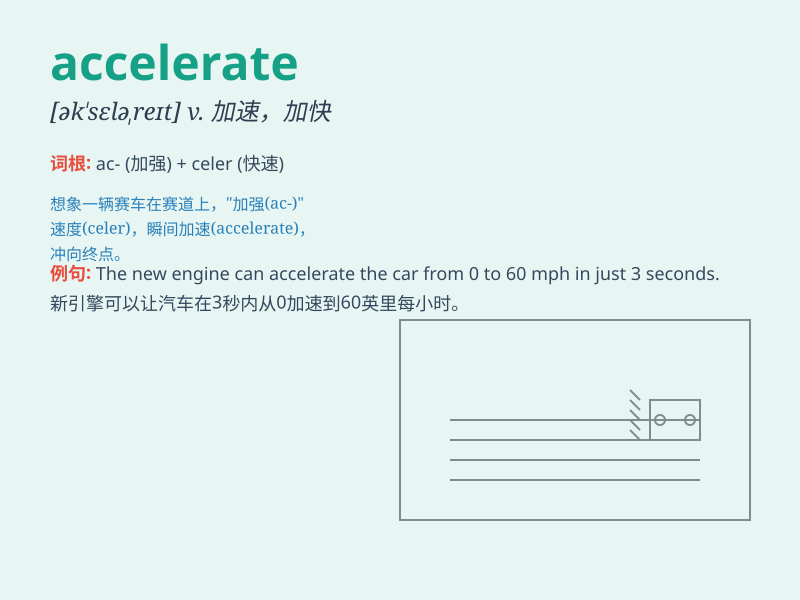

## accelerate

**英音:** _[ækˈseləreɪt]_ **美音:** _[əkˈsɛləˌret]_

**译义:** *v.加速,促进*

### 短语

+ **accelerate growth:** _加速增长_

+ **accelerate progress:** _加快进度_

+ **accelerate development:** _促进发展_

+ **accelerate the pace:** _加快步伐_

+ **accelerate change:** _加速变革_

### 例句

#### 例句1

> **The car accelerated rapidly as it entered the highway.**

**中文翻译:** 汽车进入高速公路时迅速加速。

**单词释义:** （使）加速

#### 例句2

> **The economic growth is expected to accelerate next year.**

**中文翻译:** 预计明年经济增长将会加快。

**单词释义:** 加快

#### 例句3

> **His heart rate accelerated when he saw the danger.**

**中文翻译:** 当他看到危险时，他的心率加快了。

**单词释义:** 加快

### 背诵小故事

> A race car driver was losing the competition. But when he found a
special button labeled \'accelerate\', he pushed it and the car went
faster and faster. Finally, he won the race.

**一位赛车手在比赛中处于落后。但当他发现一个标有'accelerate（加速）'的特殊按钮时，他按下了它，车子越来越快。最终，他赢得了比赛。**

### 图义

