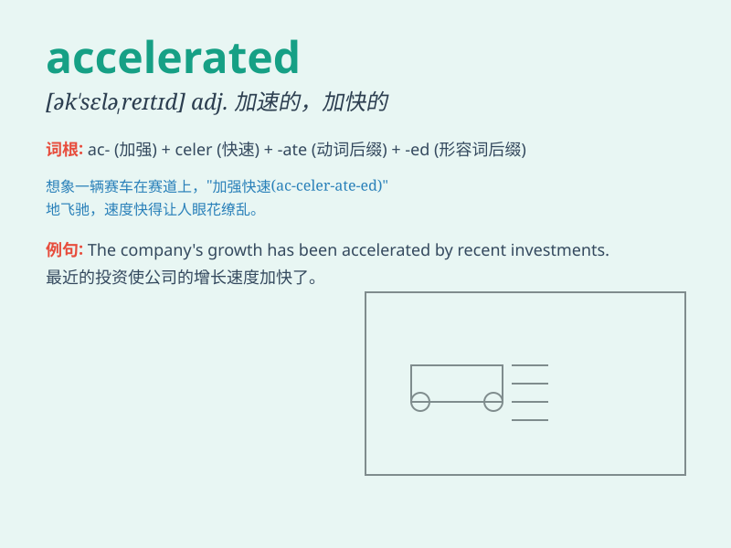

## accelerated

**英音:** _[əkˈseləreɪtɪd]_ **美音:** _[əkˈseləreɪtɪd]_

**译义:** *adj.加速的*

### 短语

+ **accelerated growth:** _加速增长_

+ **accelerated depreciation:** _加速折旧_

+ **accelerated motion:** _加速运动_

+ **accelerated learning:** _加速学习_

+ **accelerated aging:** _加速老化_

### 例句

#### 例句1

> **The car accelerated rapidly as it entered the highway.**

**中文翻译:** 汽车进入高速公路时迅速加速。

**单词释义:** 加速

#### 例句2

> **The company\'s growth has accelerated in recent years.**

**中文翻译:** 近年来，该公司的增长加速了。

**单词释义:** 加快

#### 例句3

> **Her heart rate accelerated when she saw the spider.**

**中文翻译:** 当她看到蜘蛛时，她的心率加快了。

**单词释义:** 加快

### 背诵小故事

> A little car was always slow. One day, it found a magic button and
pressed it. Suddenly, it accelerated and became very fast, leaving all
the other cars behind. It felt so excited!

**一辆小汽车总是很慢。有一天，它发现了一个神奇的按钮并按下了它。突然，它加速了，变得非常快，把其他所有车都甩在了后面。它感到非常兴奋！**

### 图义

