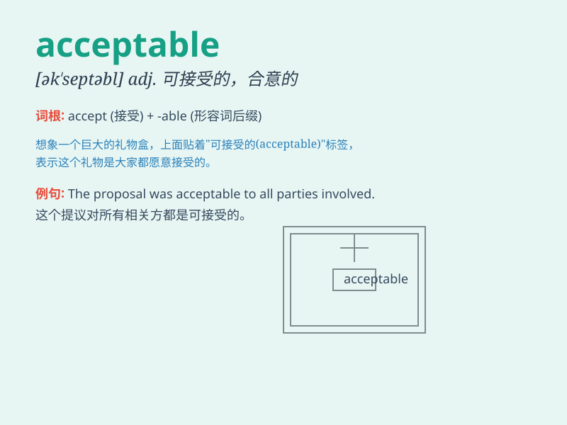

## acceptable

**英音:** _[ək\'septəb(ə)l]_ **美音:** _[ək\'sɛptəbl]_

**译义:** *adj.可接受的,合意的*

### 短语

+ **acceptable level:** _可接受的水平_

+ **acceptable risk:** _可接受的风险_

+ **acceptable quality:** _可接受的质量_

+ **acceptable solution:** _可接受的解决方案_

+ **acceptable performance:** _可接受的表现_

### 例句

#### 例句1

> **The quality of the product was acceptable.**

**中文翻译:** 这个产品的质量是可以接受的。

**单词释义:** 可接受的；令人满意的

#### 例句2

> **His behavior was just acceptable in this situation.**

**中文翻译:** 在这种情况下，他的行为还算可以接受。

**单词释义:** 过得去的；尚可的

#### 例句3

> **The proposal is acceptable to most people.**

**中文翻译:** 这个提议对大多数人来说是可以接受的。

**单词释义:** 能接受的；可接纳的

### 背诵小故事

> A hungry mouse was looking for food. It finally found some cheese
that was acceptable. It happily ate it and felt satisfied. The cheese
was not perfect but good enough to satisfy the mouse\'s hunger.

**一只饥饿的老鼠正在寻找食物。它最终找到了一些可以接受的奶酪。它高兴地吃了，感到很满足。这些奶酪不完美，但足以满足老鼠的饥饿。**

### 图义

