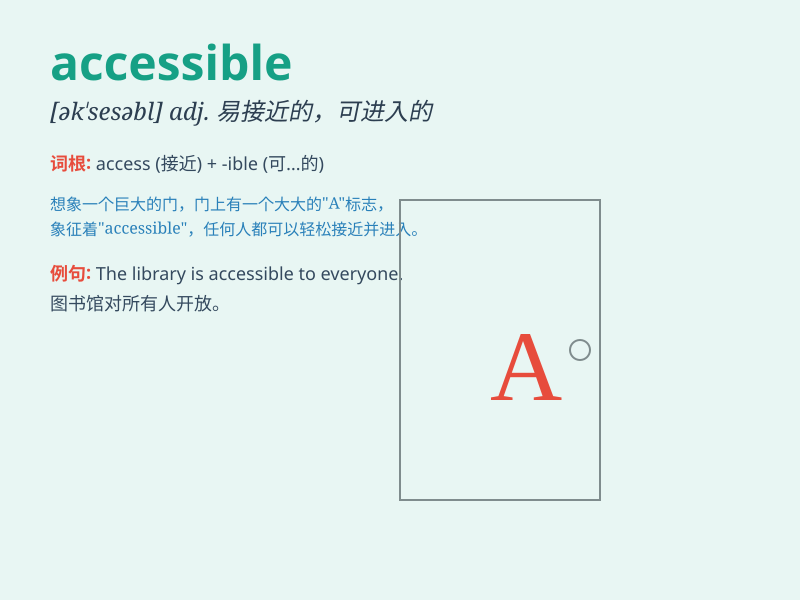

## accessible

**英音:** _[ək\'sesɪb(ə)l]_ **美音:** _[ək\'sɛsəbl]_

**译义:** *adj.易接近的,可到达的,易受影响的,可理解的*

### 短语

+ **accessible information:** _可获取的信息_

+ **accessible location:** _容易到达的位置_

+ **accessible price:** _可承受的价格_

+ **accessible route:** _畅通的路线_

+ **accessible service:** _易获得的服务_

### 例句

#### 例句1

> **The information on this website is accessible to all users.**

**中文翻译:** 这个网站上的信息所有用户都能获取。

**单词释义:** 可获取的；可得到的

#### 例句2

> **The museum is accessible by public transportation.**

**中文翻译:** 这家博物馆可以乘坐公共交通到达。

**单词释义:** 可到达的；可进入的

#### 例句3

> **This book is written in an accessible style.**

**中文翻译:** 这本书以一种通俗易懂的风格写成。

**单词释义:** 易懂的；易接近的

### 背诵小故事

>
想象一个神秘的城堡，里面藏着珍贵的宝藏。但只有一条道路能通往城堡内部，这条路清晰可见且容易行走，大家都能通过它到达宝藏所在地。这条路就像accessible，意味着容易接近、可进入的。

**想象一个城堡道路的故事来辅助记忆'accessible'这个表示容易接近、可进入的单词**

### 图义

