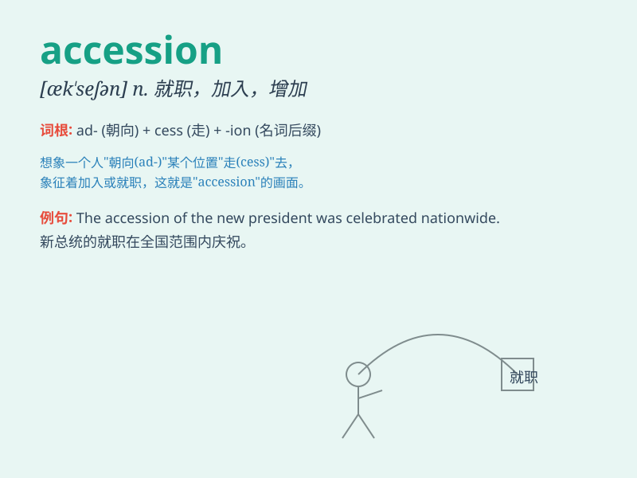

## accession

**英音:** _[ək\'seʃ(ə)n]_ **美音:** _[æk\'sɛʃən]_

**译义:** *n.就职,就任,添加,增加*

### 短语

+ **accession number:** _登录号； accession 编号_

+ **accession agreement:** _加入协议_

+ **accession criteria:** _加入标准_

+ **accession state:** _加入国_

+ **date of accession:** _加入日期_

### 例句

#### 例句1

> **The accession of new members to the club was celebrated.**

**中文翻译:** 新成员加入俱乐部这件事被庆祝了。

**单词释义:** 加入；就职

#### 例句2

> **The museum\'s accession of rare paintings has enhanced its
collection.**

**中文翻译:** 博物馆新获得的稀有画作增强了其藏品。

**单词释义:** 获得；增添

#### 例句3

> **The country\'s accession to the international treaty was a
significant event.**

**中文翻译:** 这个国家加入国际条约是一件重大事件。

**单词释义:** 加入；正式同意

### 背诵小故事

> 国王举行盛大仪式，欢迎新成员加入王室。这个新成员的加入被称为
accession。就像你获得进入一个神秘城堡的许可，那就是 accession。

**国王或新成员加入组织、团体等；就职；增加**

### 图义

