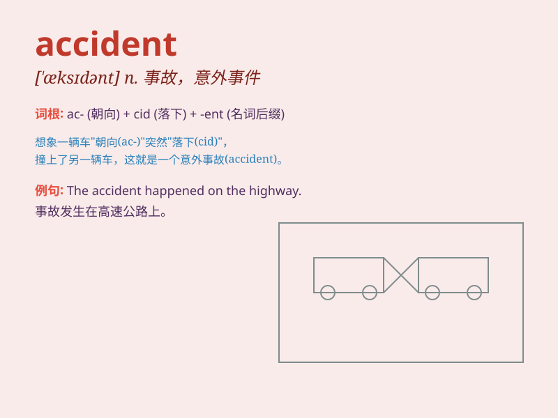

## accident

**英音:** _[\'æksɪdənt]_ **美音:** _[\'æksədənt]_

**译义:** *n.意外事件,事故*

### 短语

+ **traffic accident:** _交通事故_

+ **by accident:** _偶然；意外地_

+ **car accident:** _车祸_

+ **accident insurance:** _意外保险_

+ **industrial accident:** _工业事故_

### 例句

#### 例句1

> **The accident happened at the intersection.**

**中文翻译:** 事故发生在十字路口。

**单词释义:** 事故；意外

#### 例句2

> **It was an accident. I didn\'t mean to do it.**

**中文翻译:** 这是个意外。我不是故意这么做的。

**单词释义:** 意外；偶然

#### 例句3

> **He was injured in a car accident last week.**

**中文翻译:** 他上周在一场车祸中受伤了。

**单词释义:** 事故

### 背诵小故事

> One day, Tom was walking on the street. Suddenly, a car lost control
and hit a tree. This unexpected event was an accident. Poor Tom was
shocked but luckily not hurt.

**有一天，汤姆正在街上走。突然，一辆车失控撞到了一棵树。这个意想不到的事件就是一场事故。可怜的汤姆被吓到了，但幸运的是没有受伤。**

### 图义

