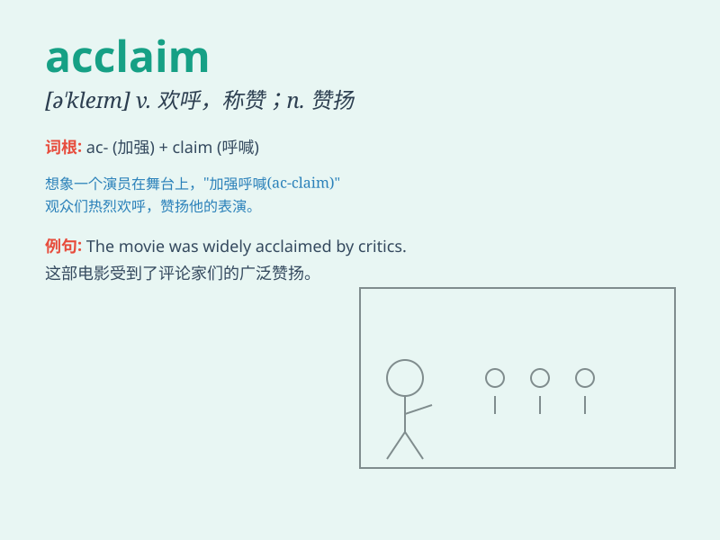

## acclaim

**英音:** _[ə\'kleɪm]_ **美音:** _[ə\'klem]_

**译义:** *n.喝彩,欢呼v.欢呼,称赞*

### 短语

+ **universal acclaim:** _普遍称赞_

+ **public acclaim:** _公众赞誉_

+ **critical acclaim:** _评论家的称赞_

+ **win acclaim:** _赢得称赞_

+ **deserve acclaim:** _值得称赞_

### 例句

#### 例句1

> **The new movie received widespread acclaim from critics and
audiences alike.**

**中文翻译:** 这部新电影受到了评论家和观众的广泛称赞。

**单词释义:** 称赞；赞扬

#### 例句2

> **The athlete was greeted with acclaim when she returned home.**

**中文翻译:** 这位运动员回家时受到了热烈的称赞。

**单词释义:** 欢呼；喝彩

#### 例句3

> **The book has achieved international acclaim for its innovative
ideas.**

**中文翻译:** 这本书因其创新的想法获得了国际赞誉。

**单词释义:** 赞誉；认可

### 背诵小故事

> A famous singer gave an amazing performance. The audience shouted and
cheered loudly, giving her great acclaim. They praised her talent and
hard work, making her feel truly loved and appreciated.

**一位著名歌手进行了一场精彩的演出。观众们大声呼喊和欢呼，给予了她高度的称赞。他们赞扬她的才华和努力，让她感到真心被喜爱和欣赏。**

### 图义

