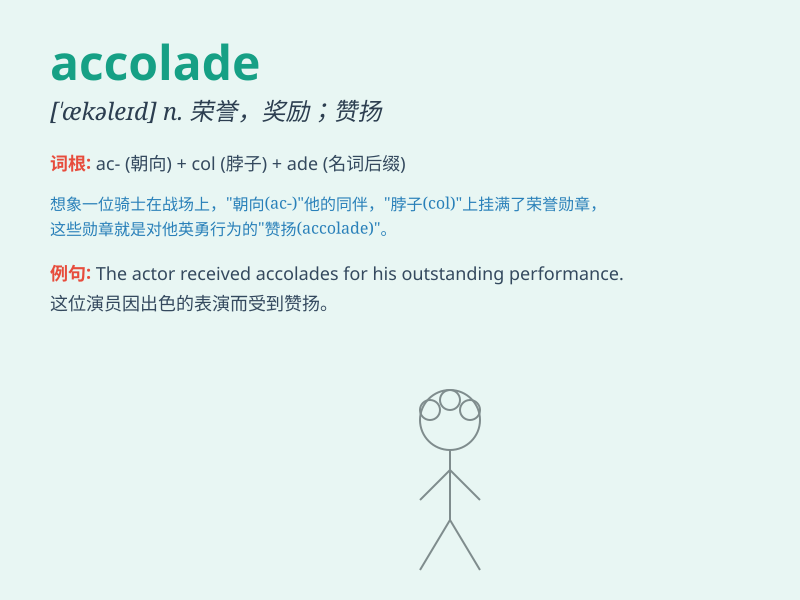

## accolade

**英音:** _[\'ækəleɪd; ,ækə\'leɪd]_ **美音:**
_[\'ækəled]_

**译义:** *n.赞美,骑士爵位的授予,连谱号*

### 短语

+ **bestow an accolade:** _授予荣誉_

+ **deserve an accolade:** _值得称赞_

+ **receive an accolade:** _获得荣誉_

+ **earn an accolade:** _赢得赞誉_

+ **give an accolade:** _给予表扬_

### 例句

#### 例句1

> **The actor received numerous accolades for his outstanding
performance.**

**中文翻译:** 这位演员因其出色的表演获得了众多的赞誉。

**单词释义:** 赞誉；表扬

#### 例句2

> **The book has won several literary accolades.**

**中文翻译:** 这本书赢得了几项文学方面的荣誉。

**单词释义:** 荣誉；奖励

#### 例句3

> **She was given the highest accolade in her field.**

**中文翻译:** 她在自己的领域获得了最高的称赞。

**单词释义:** 称赞；嘉许

### 背诵小故事

>
一位年轻的音乐家努力练习，终于在音乐会上完美演出。结束后，观众们热烈鼓掌，给予他无数的赞美和荣誉，这就是对他的accolade。

**一位年轻的音乐家努力练习，终于在音乐会上完美演出。结束后，观众们热烈鼓掌，给予他无数的赞美和荣誉，这就是对他的赞誉、表扬。**

### 图义

