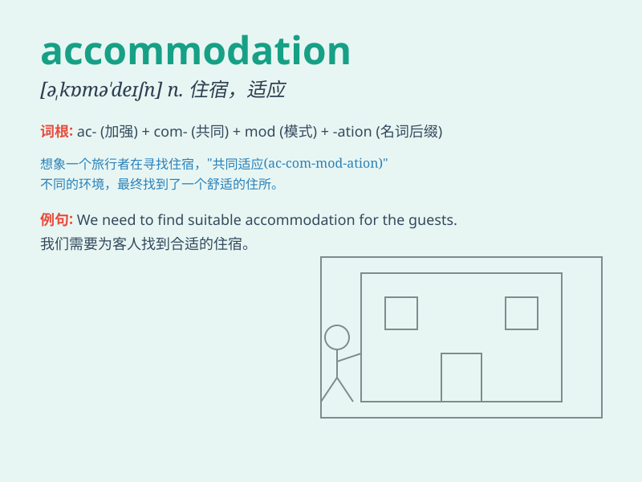

## accommodation

**英音:** _[əkɒmə\'deɪʃ(ə)n]_ **美音:**
_[ə,kɑmə\'deʃən]_

**译义:**
*n.住处,膳宿,(车,船,飞机等的)预定铺位,(眼睛等的)适应性调节,(社会集团间的)迁就融合*

### 短语

+ **accommodation facilities:** _住宿设施_

+ **temporary accommodation:** _临时住宿_

+ **student accommodation:** _学生宿舍_

+ **luxury accommodation:** _豪华住宿_

+ **accommodation address:** _住宿地址_

### 例句

#### 例句1

> **The hotel offers various types of accommodation, including single
rooms and suites.**

**中文翻译:** 这家酒店提供各种类型的住宿，包括单人间和套房。

**单词释义:** 住宿；住处

#### 例句2

> **We need to find suitable accommodation for the conference
participants.**

**中文翻译:** 我们需要为会议参与者找到合适的住处。

**单词释义:** 住处；膳宿

#### 例句3

> **The accommodation provided by the company was not
satisfactory.**

**中文翻译:** 公司提供的住宿条件不令人满意。

**单词释义:** 住宿；膳宿

### 背诵小故事

> A traveler was lost and in need of accommodation. A kind local led
him to a cozy place with beds and rooms. The traveler was grateful for
this place that provided him with a comfortable stay.

**一位旅行者迷路了，急需住宿。一位善良的当地人带他去了一个有床和房间的舒适地方。旅行者很感激这个为他提供舒适停留的地方。**

### 图义

