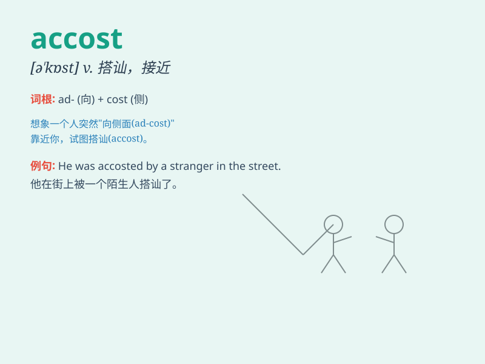

## accost

**英音:** _[ə\'kɒst]_ **美音:** _[ə\'kɔst]_

**译义:** *vt.对\...说话,搭话*

### 短语

+ **accost somebody:** _和某人搭讪_

+ **be accosted by:** _被\...搭讪_

+ **accost angrily:** _生气地搭讪_

+ **accost politely:** _礼貌地搭讪_

+ **accost suddenly:** _突然搭讪_

### 例句

#### 例句1

> **He was accosted by a stranger in the street.**

**中文翻译:** 他在街上被一个陌生人搭讪。

**单词释义:** （以不友好或挑衅的方式）上前与\...搭话

#### 例句2

> **She was accosted by a beggar asking for money.**

**中文翻译:** 她被一个要钱的乞丐拦住了。

**单词释义:** （尤指在街上）上前与\...攀谈

#### 例句3

> **The drunk man accosted several passers-by.**

**中文翻译:** 那个醉汉与好几个路人搭话。

**单词释义:** 主动跟\...攀谈

### 背诵小故事

> A thief was lurking in the dark alley. When a rich man passed by, the
thief boldly accosted him, asking for money. The rich man was shocked
but remained calm and called for help.

**一个小偷潜伏在黑暗的小巷里。当一位富人经过时，小偷大胆地跟他搭讪，要钱。富人很震惊但保持冷静并呼救。**

### 图义

