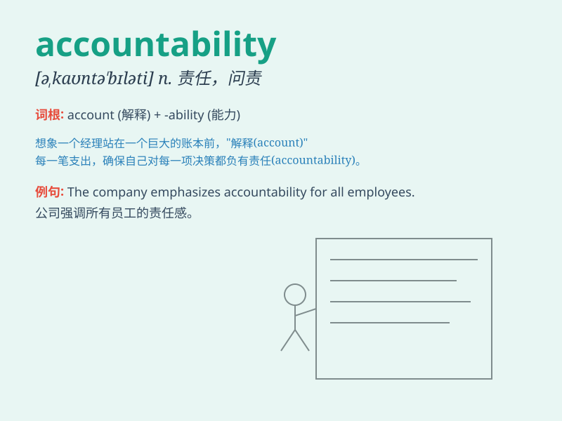

## accountability

**英音:** _[ə,kaʊntə\'bɪlɪtɪ]_ **美音:**
_[ə,kaʊntə\'bɪləti]_

**译义:** *n.有责任,有义务,可说明性*

### 短语

+ **public accountability:** _公共责任_

+ **corporate accountability:** _公司责任_

+ **accountability system:** _责任制度_

+ **political accountability:** _政治责任_

+ **fiscal accountability:** _财政责任_

### 例句

#### 例句1

> **The CEO emphasized the importance of accountability in the
company\'s decision-making process.**

**中文翻译:** 这位首席执行官强调了在公司决策过程中责任的重要性。

**单词释义:** 责任；有责任，有义务

#### 例句2

> **There needs to be greater accountability for government
spending.**

**中文翻译:** 对于政府开支需要有更大的责任追究。

**单词释义:** 责任追究；问责制

#### 例句3

> **The new policy aims to increase accountability among public
officials.**

**中文翻译:** 新政策旨在提高公职人员的责任意识。

**单词释义:** 责任；职责

### 背诵小故事

> A king trusted his ministers, but they wasted money. So, the king
demanded accountability. They had to explain and be responsible for
their actions. With accountability, the kingdom\'s finances improved.

**一位国王信任他的大臣们，但他们浪费钱财。于是，国王要求问责。他们必须解释并为自己的行为负责。有了问责制，王国的财政状况得到了改善。**

### 图义

