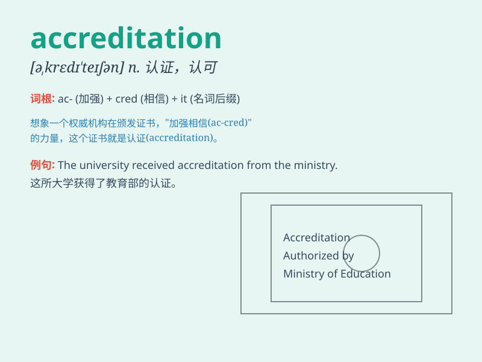

## accreditation

**英音:** _[ə,kredɪ\'teɪʃən]_ **美音:**
_[ə\'krɛdə\'teʃən]_

**译义:** *n.委派,信赖,鉴定合格*

### 短语

+ **accreditation agency:** _认证机构_

+ **accreditation process:** _认证过程_

+ **professional accreditation:** _专业认证_

+ **accreditation criteria:** _认证标准_

+ **accreditation certificate:** _认证证书_

### 例句

#### 例句1

> **The university\'s accreditation is highly regarded in the
academic world.**

**中文翻译:** 这所大学的认证在学术界备受推崇。

**单词释义:** 认证；认可

#### 例句2

> **The hospital is seeking accreditation for its new cardiac
unit.**

**中文翻译:** 这家医院正在为其新的心脏科室寻求认证。

**单词释义:** 认证

#### 例句3

> **Accreditation of the course ensures its quality and
standards.**

**中文翻译:** 该课程的认证确保了其质量和标准。

**单词释义:** 认证；鉴定

### 背诵小故事

> A small school was striving for accreditation. They worked hard,
improved facilities, and enhanced teaching quality. Finally, they got
the accreditation and became famous.

**一所小型学校一直在努力争取认证。他们努力工作，改善设施，提高教学质量。最终，他们获得了认证并出名了。**

### 图义

