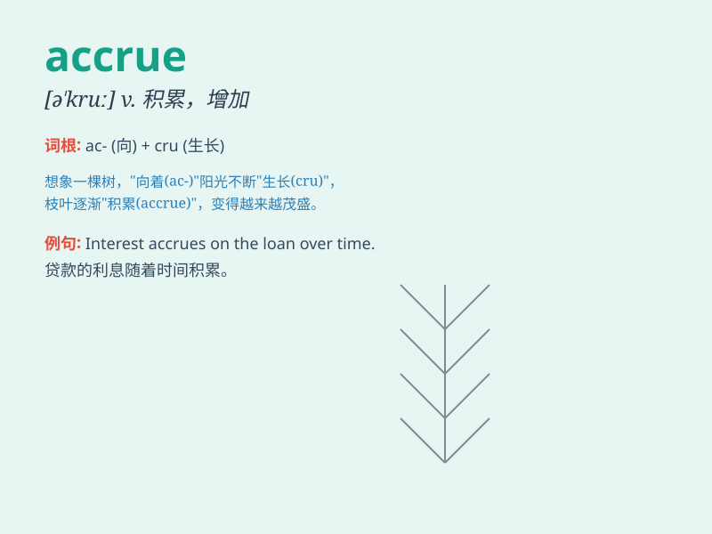

## accrue

**英音:** _[ə\'kruː]_ **美音:** _[ə\'kru]_

**译义:** *vi.自然增加,产生*

### 短语

+ **accrue interest:** _产生利息_

+ **accrue benefits:** _累积利益_

+ **accrue debts:** _累积债务_

+ **accrue experience:** _积累经验_

+ **accrue points:** _累积积分_

### 例句

#### 例句1

> **Interest accrues on the loan over time.**

**中文翻译:** 随着时间的推移，贷款会产生利息。

**单词释义:** 产生；积累

#### 例句2

> **Benefits will accrue to you if you work hard.**

**中文翻译:** 如果你努力工作，好处会累积到你身上。

**单词释义:** 累积；增多

#### 例句3

> **The company\'s profits accrue mainly from overseas sales.**

**中文翻译:** 这家公司的利润主要来自海外销售的积累。

**单词释义:** 积累；增加

### 背诵小故事

>
想象一个银行账户，每过一段时间，利息就会自动增加，这种利息的自然增长就叫
accrue。就像小明把钱存银行，啥也不做，利息却不断累积增加。

**想象银行账户中利息的自动增加来记住 accrue
这个表示自然增长、累积的单词**

### 图义

