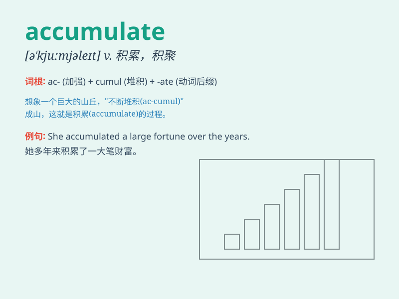

## accumulate

**英音:** _[ə\'kjuːmjʊleɪt]_ **美音:** _[ə\'kjumjəlet]_

**译义:** *v.积聚,堆积*

### 短语

+ **accumulate experience:** _积累经验_

+ **accumulate wealth:** _积累财富_

+ **accumulate knowledge:** _积累知识_

+ **accumulate evidence:** _收集证据_

+ **accumulate points:** _积累分数_

### 例句

#### 例句1

> **I have accumulated a lot of stamps over the years.**

**中文翻译:** 多年来我积累了很多邮票。

**单词释义:** 积累

#### 例句2

> **Snow accumulated on the ground during the night.**

**中文翻译:** 夜里地面上积了雪。

**单词释义:** 堆积

#### 例句3

> **He accumulated a large fortune through hard work and smart
investments.**

**中文翻译:** 他通过努力工作和明智的投资积累了一大笔财富。

**单词释义:** 积攒

### 背诵小故事

>
想象一个勤劳的小松鼠，每天都在森林里收集坚果。它从不偷懒，一颗一颗地把坚果积累起来，准备过冬。这个过程就是\'accumulate\'，就像小松鼠积累坚果一样，不断地聚集、累积。

**想象一只勤劳的小松鼠每天收集坚果来积累过冬食物的过程，以此辅助记忆\'accumulate\'（积累、积聚）这个单词。**

### 图义

