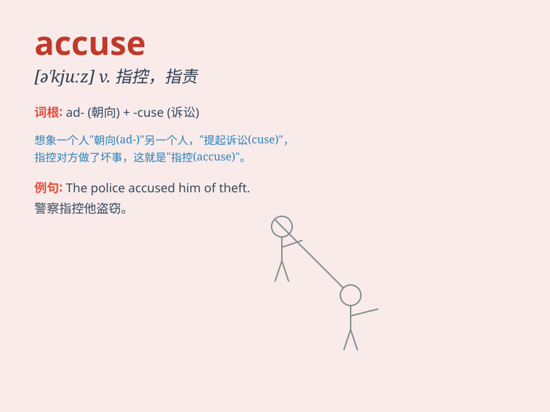

## accuse

**英音:** _[ə\'kjuːz]_ **美音:** _[ə\'kjuz]_

**译义:** *vt.控告,谴责,非难*

### 短语

+ **accuse sb of sth:** _指责某人某事_

+ **be accused of:** _被指控；被指责_

+ **accuse falsely:** _诬告；错告_

+ **accuse openly:** _公开指责_

+ **accuse seriously:** _严厉指责_

### 例句

#### 例句1

> **The police accused him of theft.**

**中文翻译:** 警察指控他盗窃。

**单词释义:** 指控

#### 例句2

> **She accused him of being dishonest.**

**中文翻译:** 她指责他不诚实。

**单词释义:** 指责

#### 例句3

> **He was accused of murder.**

**中文翻译:** 他被指控犯有谋杀罪。

**单词释义:** 指控

### 背诵小故事

> One day, a thief was caught stealing in the market. The police
accused him of the crime. The thief tried to deny it, but the evidence
was clear. \'Accuse\' means to charge someone with a crime or fault.

**有一天，一个小偷在市场行窃被抓。警察指控他犯罪。小偷试图否认，但证据确凿。\'accuse\'意思是指控某人有罪或有过错。**

### 图义

