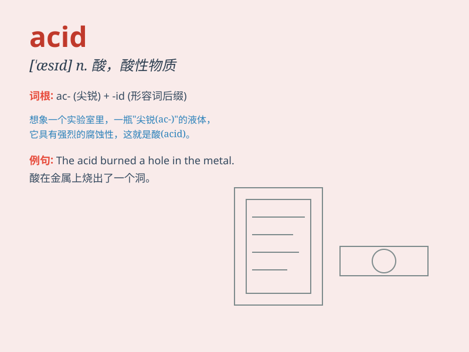

## acid

**英音:** _[\'æsɪd]_ **美音:** _[\'æsɪd]_

**译义:**
*n.酸,\<俚>迷幻药;adj.酸的,讽刺的,刻薄的;\"atomicity,consistency,isolation,and
durability\" 原子性,一致性,不相关性和持久性*

### 短语

+ **acid test:** _严峻的考验；决定性的考验_

+ **acid rain:** _酸雨_

+ **amino acid:** _氨基酸_

+ **sulfuric acid:** _硫酸_

+ **nitric acid:** _硝酸_

### 例句

#### 例句1

> **The acid rain is harmful to the environment.**

**中文翻译:** 酸雨对环境有害。

**单词释义:** 酸的；酸性的

#### 例句2

> **She has an acid tongue and always says mean things.**

**中文翻译:** 她说话尖酸刻薄，总是说些难听的话。

**单词释义:** 尖刻的；刻薄的

#### 例句3

> **The chemist tested the acid content of the solution.**

**中文翻译:** 这位化学家测试了溶液的酸性含量。

**单词释义:** 酸

### 背诵小故事

>
在一个神秘的实验室里，有一瓶绿色的液体，科学家们都很小心。因为这液体是acid（酸），具有强烈的腐蚀性，一旦不小心碰到，就会损坏物品。

**在一个神秘的实验室里，有一瓶绿色的液体，科学家们都很小心。因为这液体是酸，具有强烈的腐蚀性，一旦不小心碰到，就会损坏物品。**

### 图义

