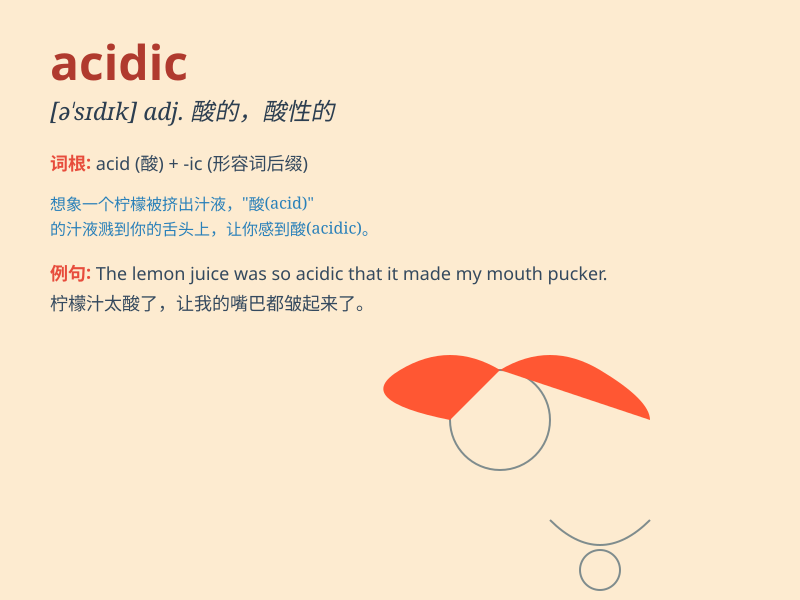

## acidic

**英音:** _[ə\'sɪdɪk]_ **美音:** _[ə\'sɪdɪk]_

**译义:** *adj.酸的,酸性的*

### 短语

+ **acidic soil:** _酸性土壤_

+ **acidic solution:** _酸性溶液_

+ **acidic environment:** _酸性环境_

+ **acidic gas:** _酸性气体_

+ **acidic reaction:** _酸性反应_

### 例句

#### 例句1

> **The soil in this area is highly acidic, which is not suitable for
most plants.**

**中文翻译:** 这个地区的土壤酸性很强，这对大多数植物来说都不合适。

**单词释义:** 酸性的（形容土壤）

#### 例句2

> **The fruit has an acidic taste that some people don\'t like.**

**中文翻译:** 这种水果有一种酸性的味道，有些人不喜欢。

**单词释义:** 酸的（形容味道）

#### 例句3

> **His remarks were rather acidic and hurtful.**

**中文翻译:** 他的话相当尖酸刻薄且伤人。

**单词释义:** 尖酸的（形容言语）

### 背诵小故事

> A scientist was doing experiments in the lab. He不小心 spilled an
acidic liquid. It was so powerful that it corroded the table quickly.
Remember, \'acidic\' means having the nature of an acid, like that
dangerous liquid.

**一位科学家在实验室做实验。他不小心洒出了一种酸性液体。它威力巨大，很快就腐蚀了桌子。记住，\'acidic\'意思是具有酸的性质，就像那种危险的液体。**

### 图义

