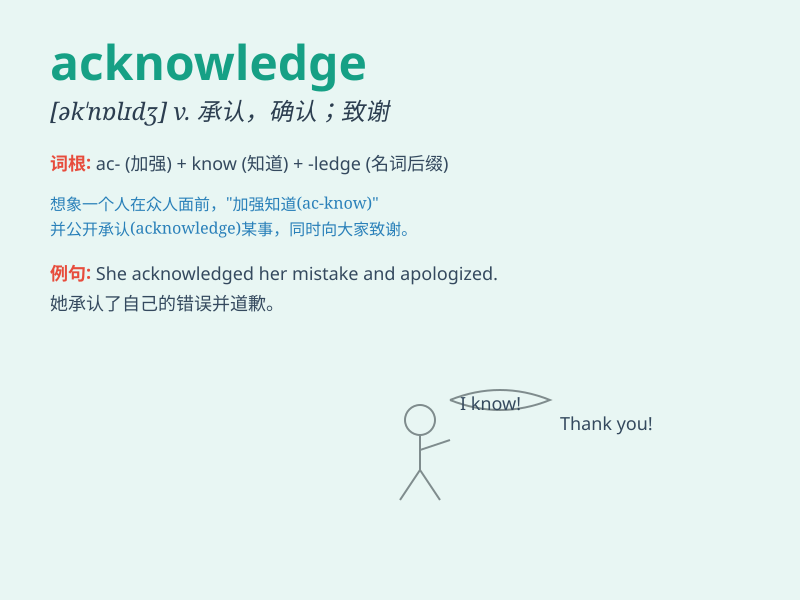

## acknowledge

**英音:** _[ək\'nɒlɪdʒ]_ **美音:** _[ək\'nɑlɪdʒ]_

**译义:** *vt.承认,答谢,报偿*

### 短语

+ **acknowledge receipt:** _确认收到_

+ **acknowledge defeat:** _承认失败_

+ **acknowledge a debt:** _承认债务_

+ **acknowledge one\'s mistake:** _承认错误_

+ **acknowledge sb as:** _承认某人是\...\..._

### 例句

#### 例句1

> **I acknowledged my mistake and promised to correct it.**

**中文翻译:** 我承认了我的错误并承诺改正。

**单词释义:** 承认

#### 例句2

> **The company acknowledged the receipt of the complaint.**

**中文翻译:** 公司确认收到了投诉。

**单词释义:** 确认

#### 例句3

> **She acknowledged his help with a smile.**

**中文翻译:** 她微笑着感谢他的帮助。

**单词释义:** 感谢

### 背诵小故事

> One day, Tom received a mysterious package. He didn\'t know who sent
it, but he decided to acknowledge the gift by writing a thank-you note.
Finally, he found out it was from his old friend. Acknowledge means to
recognize or admit something.

**一天，汤姆收到了一个神秘包裹。他不知道是谁寄的，但他决定通过写一封感谢信来承认这个礼物。最后，他发现是他的老朋友寄的。acknowledge
意思是承认；认可；答谢**

### 图义

