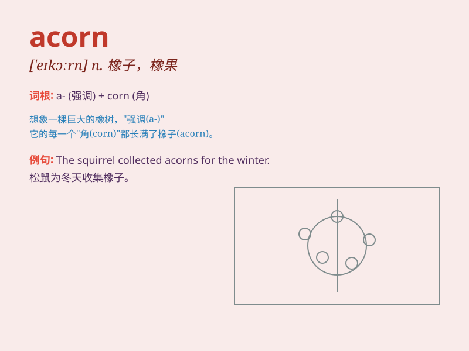

## acorn

**英音:** _[\'eɪkɔːn]_ **美音:** _[\'ekɔrn]_

**译义:** *n.[植]橡树果,橡子*

### 短语

+ **acorn squash:** _橡果形南瓜；小青南瓜_

+ **acorn cup:** _橡实壳_

+ **acorn barnacle:** _无柄藤壶_

+ **acorn woodpecker:** _橡树啄木鸟_

+ **acorn nut:** _橡子坚果_

### 例句

#### 例句1

> **The squirrel was gathering acorns for the winter.**

**中文翻译:** 松鼠正在为冬天收集橡子。

**单词释义:** 橡子

#### 例句2

> **The oak tree produced a large number of acorns this year.**

**中文翻译:** 这棵橡树今年结了大量的橡子。

**单词释义:** 橡子

#### 例句3

> **She found an acorn on the forest floor.**

**中文翻译:** 她在森林的地面上发现了一颗橡子。

**单词释义:** 橡子

### 背诵小故事

> A cute squirrel was looking everywhere for food. Finally, it found an
acorn under an oak tree. It was so happy and took the acorn back to its
nest to store for the winter.

**一只可爱的松鼠到处找食物。最后，它在一棵橡树下找到了一颗橡子。它非常高兴，把橡子带回巢里为冬天储存起来。**

### 图义

