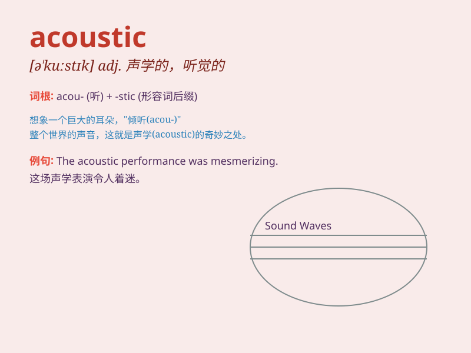

## acoustic

**英音:** _[ə\'kuːstɪk]_ **美音:** _[ə\'kʊstɪk]_

**译义:** *adj.有关声音的,声学的,音响学的*

### 短语

+ **acoustic guitar:** _原声吉他_

+ **acoustic music:** _原声音乐_

+ **acoustic impedance:** _声阻抗_

+ **acoustic system:** _声学系统_

+ **acoustic wave:** _声波_

### 例句

#### 例句1

> **The acoustic guitar sounded beautiful in the concert hall.**

**中文翻译:** 这把原声吉他在音乐厅里听起来很美妙。

**单词释义:** 原声的；声学的（指与声音的产生、传播和接收有关的）

#### 例句2

> **The room has good acoustic properties.**

**中文翻译:** 这个房间有良好的声学特性。

**单词释义:** 声学的

#### 例句3

> **She prefers acoustic music to electronic music.**

**中文翻译:** 比起电子音乐，她更喜欢原声音乐。

**单词释义:** 原声的

### 背诵小故事

> A musician was playing in a cave. The sound was amazing, without any
electronic help. It was all acoustic. The natural echoes made the music
pure and beautiful. Remember, acoustic means relating to sound or the
sense of hearing.

**一位音乐家在一个洞穴里演奏。声音令人惊叹，没有任何电子设备的辅助。这完全是原声的。天然的回声让音乐纯粹又美妙。记住，acoustic
意思是声学的；声音的；听觉的。**

### 图义

