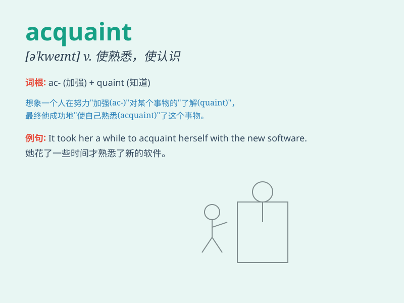

## acquaint

**英音:** _[ə\'kweɪnt]_ **美音:** _[ə\'kwent]_

**译义:** *vt.使熟知,通知*

### 短语

+ **acquaint oneself with:** _使自己熟悉；了解_

+ **acquaint sb with sth:** _使某人熟悉某物_

+ **be acquainted with:** _熟悉；了解_

+ **make sb acquainted with:** _使某人结识；使某人了解_

+ **acquaint thoroughly:** _彻底熟悉_

### 例句

#### 例句1

> **I need to acquaint myself with the new regulations.**

**中文翻译:** 我需要熟悉新的规章制度。

**单词释义:** 使熟悉

#### 例句2

> **Please acquaint him with the details of the project.**

**中文翻译:** 请让他了解这个项目的细节。

**单词释义:** 使了解

#### 例句3

> **She acquainted us with her plan for the future.**

**中文翻译:** 她向我们介绍了她未来的计划。

**单词释义:** 向\...介绍

### 背诵小故事

>
想象你在一个陌生的小镇迷路了，一位热心的当地人出现，带你熟悉（acquaint）每条街道和每个景点。他的帮助让你对这个小镇不再陌生，你成功地acquaint了这个新地方。

**想象你在陌生小镇迷路，热心当地人带你熟悉环境，助你成功了解这个新地方。**

### 图义

