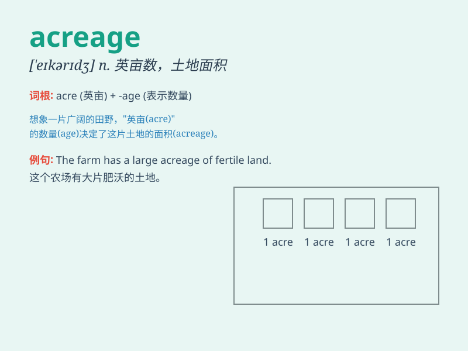

## acreage

**英音:** _[\'eɪk(ə)rɪdʒ]_ **美音:** _[\'ekərɪdʒ]_

**译义:** *n.英亩数,面积*

### 短语

+ **total acreage:** _总面积_

+ **cultivated acreage:** _耕地面积_

+ **agricultural acreage:** _农业面积_

+ **forest acreage:** _森林面积_

+ **land acreage:** _土地面积_

### 例句

#### 例句1

> **The acreage of the farm is quite large.**

**中文翻译:** 这个农场的面积相当大。

**单词释义:** 面积；英亩数

#### 例句2

> **They are planning to increase the acreage under cultivation.**

**中文翻译:** 他们正计划增加耕种面积。

**单词释义:** 面积；英亩数

#### 例句3

> **The total acreage of the vineyard is 50 acres.**

**中文翻译:** 葡萄园的总面积是 50 英亩。

**单词释义:** 面积；英亩数

### 背诵小故事

> A farmer was very proud of his large acreage. He had many acres of
fertile land. One day, a visitor came and was amazed by the vast
acreage. The farmer happily showed him around.

**一位农民为他的大片土地面积（acreage）感到非常自豪。他有很多英亩肥沃的土地。有一天，一位访客来了，对这片广阔的土地面积感到惊讶。农民高兴地带他四处参观。**

### 图义

