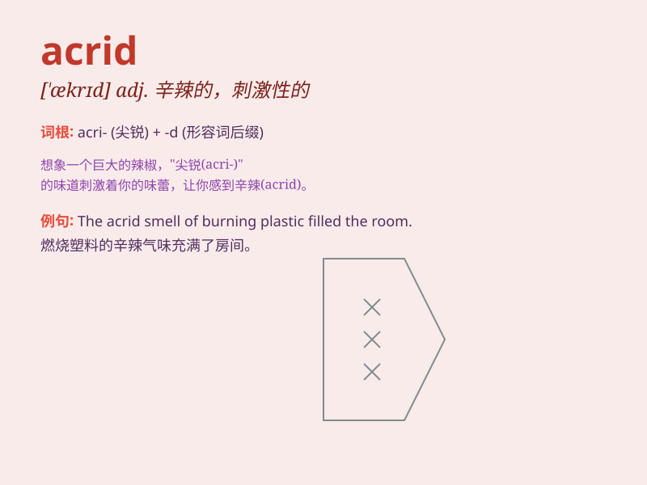

## acrid

**英音:** _[\'ækrɪd]_ **美音:** _[\'ækrɪd]_

**译义:** *adj.辛辣的,(言语或语调)刻薄的*

### 短语

+ **acrid smell:** _刺鼻的气味_

+ **acrid smoke:** _辛辣的烟雾_

+ **acrid taste:** _辛辣的味道_

+ **acrid comment:** _尖刻的评论_

+ **acrid atmosphere:** _刻薄的氛围_

### 例句

#### 例句1

> **The acrid smell of smoke filled the room.**

**中文翻译:** 刺鼻的烟味充满了房间。

**单词释义:** 刺鼻的

#### 例句2

> **His acrid remarks made everyone uncomfortable.**

**中文翻译:** 他尖刻的话语让每个人都感到不舒服。

**单词释义:** 尖刻的

#### 例句3

> **The acrid taste of the medicine made her grimace.**

**中文翻译:** 这药的辛辣味道让她做了个鬼脸。

**单词释义:** 辛辣的

### 背诵小故事

> A crow was flying in the acrid smoke from a factory. The smell was so
strong and unpleasant that it made the crow cough. Remember, \'acrid\'
means sharp and unpleasant, just like that smoke.

**一只乌鸦在工厂冒出的刺鼻烟雾中飞行。那气味浓烈且令人不适，以至于乌鸦都咳嗽了。记住，'acrid'意思是辛辣的、刺鼻的，就像那股烟雾。**

### 图义

