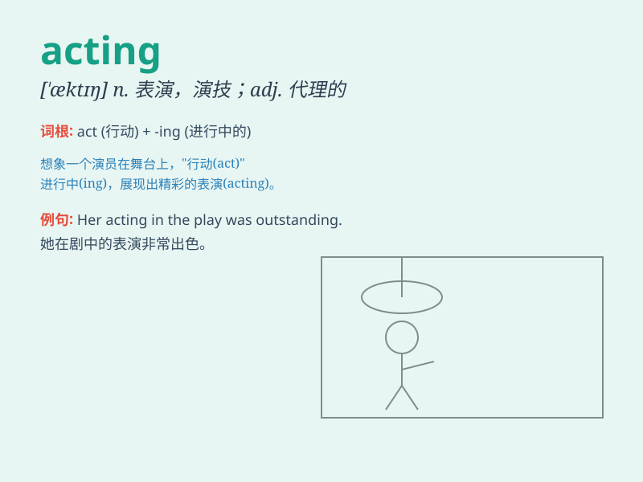

## acting

**英音:** _[\'æktɪŋ]_ **美音:** _[\'æktɪŋ]_

**译义:** *adj.代理的,起作用的,演戏的*

### 短语

+ **acting career:** _演艺生涯_

+ **acting skills:** _表演技巧_

+ **acting part:** _扮演的角色_

+ **acting out:** _表现出来；将...付诸行动_

+ **acting president:** _代总统_

### 例句

#### 例句1

> **She has always dreamed of a career in acting.**

**中文翻译:** 她一直梦想着从事演艺事业。

**单词释义:** 表演；演艺

#### 例句2

> **His acting skills are highly praised by the critics.**

**中文翻译:** 他的表演技巧受到评论家的高度赞扬。

**单词释义:** 表演；演技

#### 例句3

> **The acting in this play is quite impressive.**

**中文翻译:** 这部戏中的表演相当令人印象深刻。

**单词释义:** 表演

### 背诵小故事

> A young man dreamed of being a great actor. He started with small
acting roles in school plays. Through hard work and practice, he
improved his acting skills and finally got a chance in a big movie.

**一个年轻人梦想成为伟大的演员。他从学校戏剧中的小角色开始。通过努力和练习，他提高了自己的表演技能，最终在一部大电影中获得了机会。**

### 图义

