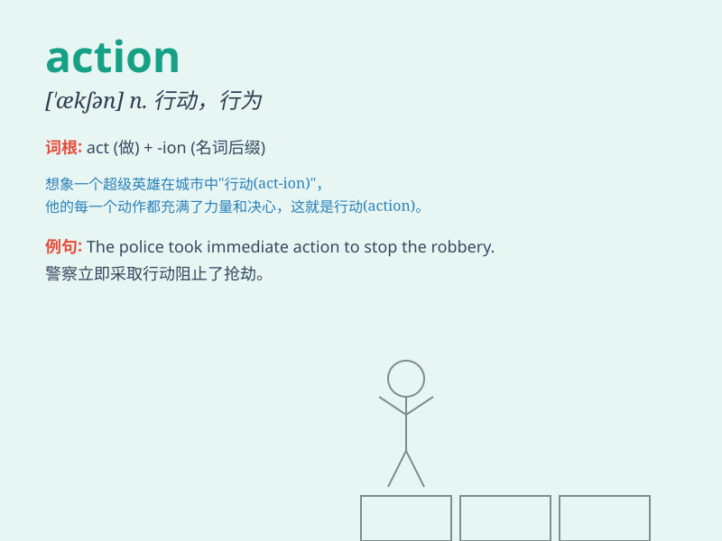

## action

**英音:** _[\'ækʃ(ə)n]_ **美音:** _[\'ækʃən]_

**译义:**
*n.动作,作用,战斗,行动,举动,行为,(戏剧或书中)的情节,(某一地区、领域或团体中)最能产生效果、最有趣、最有刺激性的活动vt.对\...起诉*

### 短语

+ **take action:** _采取行动；着手行动_

+ **in action:** _在活动中；在运转中；在战斗中_

+ **action plan:** _行动计划；行动方案_

+ **course of action:** _行动方针；行动步骤_

+ **out of action:** _失灵；失去作用；损坏_

### 例句

#### 例句1

> **His quick action saved the child\'s life.**

**中文翻译:** 他迅速的行动救了孩子的命。

**单词释义:** 行动

#### 例句2

> **The movie is full of exciting actions.**

**中文翻译:** 这部电影充满了令人兴奋的动作场面。

**单词释义:** 动作

#### 例句3

> **We need to take action to solve this problem.**

**中文翻译:** 我们需要采取行动来解决这个问题。

**单词释义:** 行动

### 背诵小故事

> A brave hero was always ready for action. One day, a monster attacked
the village. Without hesitation, the hero took action and fought
bravely, saving everyone. Remember, \'action\' means doing something!

**一位勇敢的英雄总是准备好行动。有一天，一只怪物袭击了村庄。英雄毫不犹豫地采取行动，英勇战斗，拯救了所有人。记住，'action'意思是行动！**

### 图义

